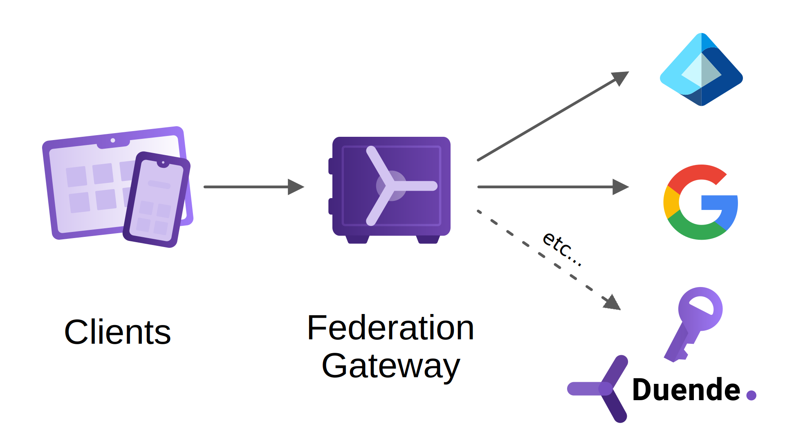
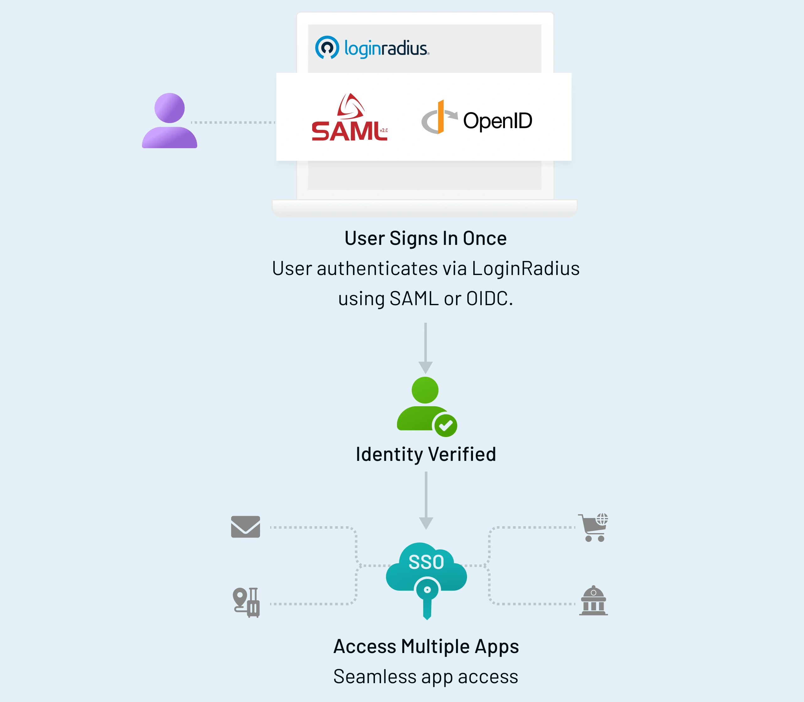

# identity-management
Identity Management is a standalone microservice designed to handle user authentication and authorization. It centralizes user authentication, providing a secure entry point for all microservices 
The service implements OpenID Connect (OIDC) through Duende Identity Server and is responsible for managing user-specific data, including multi-factor authentication (MFA) configurations

This uses duende/ authlete to serve as its OpenID Connect(OIDC) provider,handling authentication with efficiency

To understand how IdM works, it helps to break it down into four key functions:
- Identification: Who are you? (e.g., a username or email).
- Authentication: Prove it. (e.g., passwords, biometrics, or security tokens).
- Authorization: What are you allowed to do? (e.g., Can you view the file, or can you edit it?).
- Auditing: What did you do? (Tracking actions to ensure compliance and security).

*Duende is a library while Keycloak is a product*

both duende and authlete are built for developers who want to build their own identityPrvider(Idp)

| Feature | Duende IdentityServer | Authlete |
| :--- | :--- | :--- |
| Type | Software Library / SDK | "Semi-Hosted" Backend-as-a-Service |
| Language | Strictly .NET / C# | Language Agnostic (any language) |
| Data Storage | You manage the DB (SQL, etc.) | Authlete stores the OAuth tokens/clients |
| User Data | You manage the users | You manage the users (Authlete never sees them) |
| UI / UX | You build the UI in your app | You build the UI in your app |

When to choose Authlete over Duende
- Multi-Language: If your team doesn't use .NET, Duende isn't an option. Authlete works with everything.
- Compliance: Authlete is obsessed with high-level security standards (like FAPI for banking). If you are in FinTech, Authlete is often easier than configuring Duende to meet those specific audits.
- Infrastructure: If you want to offload the headache of managing "Token Lifecycles" (revoking tokens, rotating keys) but still want 100% control over your Login UI, Authlete is the middle ground

## What is the difference between api level and scope level claims? 
A Claim is a piece of data (like email: "bob@me.com" or role: "admin"), and a Scope is just a "container" or "permission" that the client asks for.

## `Scope` 
A scope is a named permission that a client can request when asking for an access token. Scopes are defined in the IdentityServer configuration and can be associated with specific claims. When a client requests a scope, the claims associated with that scope are included in the access token if the user consents to it.
- profile: Claims inside it: `given_name`, `family_name`, `birthdate`.
- A shipping scope that only includes the address claim

In Duende IdentityServer (and OpenID Connect in general), a `scope` is essentially just a named collection of `claims`. You can define custom scopes and explicitly tell the Identity provider exactly which claims belong inside them.
To make a `shipping` scope that only includes the address claim, you define it as an Identity Resource in your IdentityServer configuration.

```c#
public static IEnumerable<IdentityResource> IdentityResources =>
    new List<IdentityResource>
    {
        // Standard scopes
        new IdentityResources.OpenId(),
        new IdentityResources.Profile(),
        
        // Custom shipping scope mapping to the 'address' claim
        new IdentityResource(
            name: "shipping",
            displayName: "Shipping Details",
            userClaims: new[] { "address" } // Only include the address claim
        )
    };
```

## Api Rescources
The concept of API Resources was introduced primarily to solve security, privacy, and architectural problems that arise when you strictly rely on "Scopes" in a distributed microservices environment.
Historically, OAuth 2.0 just dealt with scopes (e.g., read, write). But as architectures grew into multiple distinct APIs, relying only on scopes created several major issues:

1. **The "Audience" Problem (Preventing Token Leakage)**
Imagine a client application gets an access token with a broad scope like `user.read`. The token doesn't specify which API it's meant for. If the client uses that token to call the Shipping API, the Shipping API has no way of knowing if that token was intended for it or for another API (like Billing).
- The client sends this token to the Shipping API.
- If the Shipping API acts maliciously (or is compromised), it could take that exact same token and use it against the Billing API, because the token simply says it has `user.read` access.
- The Fix: API Resources allow the Identity Provider to track which physical/logical APIs are tied to the requested scopes. The IdentityProvider uses this to populate the `aud` (Audience) claim in the token.
If a token is generated for the Shipping API Resource, its `aud` claim will be `shipping_api`. When the Billing API receives it, it will inspect the `aud` claim, see `shipping_api`, and immediately reject it.

2. **Token Bloat and Privacy**
If you have 10 different microservices, they might all need different pieces of user data. Your BillingAPI needs a `credit_card_id`, and your ShippingAPI needs an `address`.
If you didn't have API Resources, the Identity Provider wouldn't know which API the token was ultimately going to. To be safe, it would have to stuff every possible claim related to the requested scopes into the token.
- The Result: The JWT becomes massively bloated (causing HTTP header size limits to be exceeded), and you leak sensitive billing data to the Shipping API.
- The Fix: By defining an ApiResource, you tell IdentityServer: "When a token is being built specifically for this API Resource, only put these specific claims into it."
3. **Decoupling Permissions (Scopes) from Physical APIs (Resources)**
Sometimes, you want multiple APIs to share the same overarching permission
4. **Support for Resource Indicators (RFC 8707)**
API Resources align well with the newer OAuth 2.0 Resource Indicators specification, which allows clients to explicitly request access tokens for specific target services using the resource parameter
```sql
INSERT INTO api_resource_scopes (api_resource_id, scope)
VALUES 
    ((SELECT id FROM api_resources WHERE name = 'accounting_api'), 'data.read'),
    ((SELECT id FROM api_resources WHERE name = 'shipping_api'), 'data.read');
```  
 the scope `data.read` is a conceptual permission. But the API Resources represent the actual physical boundaries (`accounting_api` and `shipping_api`). Because of API Resources, if a client requests `data.read`, IdentityServer knows to put both `accounting_api` and `shipping_api` into the token's `aud` array, granting the token safe passage to both systems without needing to create redundant scopes like `accounting.data.read` and `shipping.data.read`.  

 ## ApiResourceProperty
 In Duende IdentityServer, an `ApiResourceProperty` is simply a custom key-value pair used to store arbitrary metadata about an `API Resource`.
While IdentityServer provides standard fields for an `ApiResource` (like `Name`, `DisplayName`, `Scopes`, and `UserClaims`), every application has unique business requirements. Instead of forcing you to modify the core database schema every time you need to store extra information about an API, IdentityServer provides the `Properties` collection.

### Common Use Cases for ApiResourceProperty:
- `UI Hints / Customization`: You might add a property like Key: `"icon_url", Value: "https://.../billing-icon.png"`. Your admin dashboard or user consent screen can read this property to render a nice UI.
- `Integration with External Systems`: Storing an internal ID or legacy system mapping (e.g., Key: `"legacy_system_id", Value: "10485"`).

## ApiResourceScope
An `ApiResourceScope` is a specific scope that belongs to an API Resource. It represents a permission or action that clients can request when they want to access that API.

When you define an `ApiResource`, you can associate it with one or more `ApiResourceScopes`. Each scope represents a specific permission or level of access within that API. When a client requests a scope, IdentityServer checks which API Resource it belongs to and includes the appropriate claims in the access token.
it defines which scopes (permissions) are valid for this specific API.
It acts as a junction (mapping) between a physical API (`ApiResource`) and a permission (`ApiScope`).

If a client asks for `scope=data.read`, IdentityServer looks up all ApiResourceScope records. If it finds a link between data.read and the `InvoicingAPI` resource, it adds `InvoicingAPI` to the token's `aud` (audience) claim so the token can be used there
## API-Level Claims(ApiResourceClaims)
API-level claims (often referred to in Duende as ApiResource Claims) are tied to the entire API, regardless of which specific scope was used. "If you are calling any part of this API, you always need these pieces of data."
Example: API Resource: InvoicingAPI
Claims inside it: `tenant_id`, `subscription_level`.

No matter if the client asks for `invoicing.read` or `invoicing.admin`, as long as they are hitting the `InvoicingAPI`, the Identity Server will include the `tenant_id` and `subscription_level` in the access token.

Best for Infrastructure data that the API needs for every single request (like a `user_id` or `org_id`) to perform basic routing or database filtering

When a user logs in, they might have 50 different claims (`role`, `department`, `location`, `manager`, `employee_id`, etc.) in your database. You don't want to put all 50 claims into every system's access token because it would make the tokens massive (token bloat).

IdentityServer uses the `ApiResourceClaim` entries to ask the IProfileService: "The client is asking for a token for the Billing API. The Billing API only defined `'role'` and `'department'` in its `ApiResourceClaims`. Please only fetch those two user claims and put them in the token."

Conceptually, it defines "claims needed by the API". Mechanically, IdentityServer uses it as a whitelist to filter User Claims during token generation. If you are dealing with machine-to-machine tokens, `ApiResourceClaim` won't really do anything.

### Common Real-World Use Cases
- `Multi-Tenancy (Routing & Filtering)`: Claims like `tenant_id` or `organization_id`. Every single endpoint in your AccountingAPI needs to know which company's data to manipulate. It doesn't matter if the client is doing a "read" or a "write"; the API fundamentally needs the `tenant_id`.
- `Global Access Control`: Claims like `role` or `subscription_tier`. If the API needs to globally rate-limit "free" tier users or globally reject requests from users without the "employee" role, those claims must always be present.
- `Legacy Integration`: An API might route requests to a legacy system that uniformly requires an `employee_number` mapped to a specific HTTP header for every call.

```sql
START TRANSACTION;

-- 1. Create the Scopes
INSERT INTO api_scopes (name, display_name) 
VALUES ('data.read', 'Shared Data Access');

-- 2. Create the Resources
INSERT INTO api_resources (name, display_name) 
VALUES ('accounting_api', 'Accounting System'),
       ('shipping_api', 'Logistics System');

-- 3. Link the SAME scope to BOTH resources
-- This causes BOTH names to appear in the 'aud' claim
INSERT INTO api_resource_scopes (api_resource_id, scope)
VALUES 
    ((SELECT id FROM api_resources WHERE name = 'accounting_api'), 'data.read'),
    ((SELECT id FROM api_resources WHERE name = 'shipping_api'), 'data.read');

COMMIT;
```

```scala
case class ApiResource(
    id: Int,
    name: String,
    displayName: Option[String] = None,
  secrets: List[ApiResourceSecret] = Nil,
    scopes: List[ApiResourceScope] = Nil,
    userClaims: List[ApiResourceClaim] = Nil,
    properties: List[ApiResourceProperty] = Nil
)

final case class ApiResourceScope(
    id: Int,
    scope: String,
    apiResourceId: Int,
    apiResource: Option[ApiResource] = None
)
final case class ApiResourceClaim(
    id: Int,
    claimType: String,
    apiResourceId: Int,
    apiResource: ApiResource
) extends UserClaim(id, claimType) // api-level claims are a special type of user claim that are always included in the token when any scope from that API is requested

final case class ApiResourceProperty(
    id: Int,
    key: String,
    value: String,
    apiResourceId: Int,
    apiResource: Option[ApiResource] = None
) extends Property(id, key, value)
```

```json
{
  "iss": "https://identity.yourcompany.com",
  "sub": "user_123",
  "aud": [
    "payment_service",
    "inventory_service"
  ],
  "scope": [
    "openid",
    "api.read"
  ],
  "exp": 1704450000
}
```
```json
{
  "client_id": "react_app",         <-- WHO asked for this token
  "scope": ["data.read"],           <-- WHAT they are allowed to do
  "aud": [
    "InvoicingAPI",                 <-- WHERE this token is allowed to be sent
    "ReportingAPI"
  ]
}
```
## Api Scope
```scala
final case class ApiScope(
    id: Int,
    name: String,
    displayName: Option[String] = None,
    userClaims: List[ApiScopeClaim] = Nil,
    properties: List[ApiScopeProperty] = Nil
)
```
## ApiScopeClaim vs ApiResourceClaim
Both determine which user claims (like `role`, `department`, `tenant_id`) get injected into the access token, but they trigger at different levels. IdentityServer takes the union of both lists when generating the token.

- `ApiScopeClaim (Permission-level)`:
Trigger: Included only when this specific scope is requested.
Use Case: Use this when a specific action requires specific user data.
Example: The `transfer_funds` scope requires the user's `spending_limit` claim. If they only ask for `view_balance`, they don't get the `spending_limit` claim in their token.
- `ApiResourceClaim (API-level)`:
Trigger: Included whenever any scope belonging to this API Resource is requested (or if the API is requested directly via Resource Indicators).
Use Case: Use this when an API needs a claim for every request, regardless of the granular permission being used.
Example: The `Billing_API` resource requires the `tenant_id` claim for data isolation. Whether the client requests `billing.read` or `billing.write`, the token will always include `tenant_id`.

### ApiScopeProperty
"RequiresMFA": "true" (You could write custom logic in IdentityServer to check if a user is asking for the `transfer_funds` scope, read this property, and force them to do 2-Factor Authentication if it's set to true).

Duende IdentityServer is an OpenID Connect (OIDC) and OAuth 2.0 framework for ASP.NET Core. It implements the protocols that let applications authenticate users (OIDC) and obtain/issue access tokens for APIs (OAuth2).

IdentityServer is built from services registered in ASP.NET Core DI. You can swap or extend profile services, token creation, claim mappings, key management, stores (implement `IClientStore`, `IResourceStore`, `IPersistedGrantStore`), custom grant validators (extension grants / token exchange), and more.
 support for advanced features like Pushed Authorization Requests (PAR), Token Exchange, DPoP, audience/sender-constrained tokens, federation to external identity providers.



## Benefits Of A Federation Gateway

A federation gateway architecture shields your client applications from the complexities of your authentication workflows and business requirements that go along with them.

Your clients only need to trust the gateway, and the gateway coordinates all the communication and trust relationships with the external providers. This might involve switching between different protocols, token types, claim types etc.

You may federate with other enterprise identity systems like Active Directory, Azure AD, or with commercial providers like Google, GitHub, or LinkedIn. Federation can bridge protocols, and use OpenID Connect (OIDC), OAuth 2, SAML, WS-Federation, or any other protocol.

Also, the gateway can make sure that all claims and identities that ultimately arrive at the client applications are trustworthy and in a format that the client expects

## Integration Of On-premise Products With Customer Identity Systems
When building on-premise products, you have to integrate with a multitude of customer authentication systems. Maintaining variations of your business software for each product you have to integrate with, makes your software hard to maintain.

With a federation gateway, you only need to adapt to these external systems at the gateway level, all of your business applications are shielded from the technical details.

## Home Realm Discovery

Home Realm Discovery (HRD) is the process of selecting the most appropriate authentication workflow for a user, especially when multiple authentication methods are available.
Since users are typically anonymous when they arrive at the federation gateway, you need some sort of hint to optimize the login workflow. Such hint can come in many forms:
- You present a list of available authentication methods to the user. This works for simpler scenarios, but probably not if you have a lot of choices or if this would reveal your customers’ authentication systems.
- You ask the user for an identifier, such as their email address. Based on that, you infer the external authentication method . This is a common technique for SaaS systems.
- The client application can give a hint to the gateway via a custom protocol parameter of IdentityServer’s built-in support for the `idp` parameter on `acr_values`. In some cases, the client already knows the appropriate authentication method. For example, when your customers access your software via a customer-specific URL, you can present a subset of available authentication methods to the user, or even redirect to a single option.
- You restrict the available authentication methods per client in the client configuration using the `IdentityProviderRestrictions` property

Every system has unique requirements. Always start by designing the desired user experience, then select and combine the appropriate HRD strategies to implement your required flow.

## SQL
A many-to-many relationship occurs when multiple records in Table A can be associated with multiple records in Table B

Example: A Student can enroll in many Courses, and a Course can have many Students.

### The Junction Table Solution
To model this, you create a third table that sits between the two entities. This table "breaks down" the M:M relationship into two one-to-many (1:M) relationships.

In the junction table, the Primary Key is usually a Composite Key—a combination of both Foreign Keys

```sql
CREATE TABLE Enrollments (
    student_id INT,
    course_id INT,
    enrollment_date DATE, -- You can add extra "attribute" data here!
    PRIMARY KEY (student_id, course_id),
    FOREIGN KEY (student_id) REFERENCES Students(id),
    FOREIGN KEY (course_id) REFERENCES Courses(id)
);
```
### Unique Constraint
A Unique Constraint ensures that all values in a column (or a group of columns) are different from each other. No two rows can have the same value

### Foreign Key (FK)
A Foreign Key is a column that points to the Primary Key or a Unique column of another table
Maintain Referential Integrity. It ensures that you cannot add a record to Table B that doesn't exist in Table A.

In an `Orders` table, the `customer_id` is a Foreign Key that points back to the Customers table. You can't place an order for a customer who doesn't exist.

### PRIMARY KEY

A combination of NOT NULL and UNIQUE. It uniquely identifies each row in a table
Use a Unique Constraint when...
your primary goal is `Data Integrity`. If you want other tables to be able to point to this column as a Foreign Key, you should use a `Constraint`. Postgres requires the target of a Foreign Key to be either a `Primary Key` or have a formal `Unique Constraint`.

```sql
ALTER TABLE idmgmt.identity_provider 
ADD CONSTRAINT uq_config_id UNIQUE (configuration_id);
```

Use a Unique Index when...
...you need Advanced Features that constraints don't support. Postgres indexes are more flexible. For example, you can create a Partial Unique Index:

```sql
-- This ensures configuration_id is unique ONLY for active providers
CREATE UNIQUE INDEX ux_active_config 
ON idmgmt.identity_provider (configuration_id) 
WHERE deleted_at IS NULL;
```
### How they overlap in Postgres
When you create a Unique Constraint, Postgres secretly runs a `CREATE UNIQUE INDEX` in the background. It needs that index to check if a value already exists without scanning the whole table every time you insert a row.

## Key Management
Duende IdentityServer issues several types of tokens that are cryptographically signed, including identity tokens, JWT access tokens, and logout tokens. To create those signatures, IdentityServer needs key material. That key material can be configured automatically, by using the Automatic Key Management feature, or manually, by loading the keys from a secured location with static configuration.

IdentityServer supports signing tokens using the `RS`, `PS` and `ES` family of cryptographic signing algorithms.

Automatic Key Management follows best practices for handling signing key material, including
- automatic rotation of keys
- secure storage of keys at rest using data protection
- announcement of upcoming new keys
- maintenance of retired keys

## Managed Key Lifecycle
Keys created by Automatic Key Management move through several phases. First, new keys are announced, that is, they are added to the list of keys in discovery, but not yet used for signing. After a configurable amount of `PropagationTime`, keys are `promoted` to be signing credentials, and will be used by IdentityServer to sign tokens. Eventually, enough time will pass that the key is older than the configurable `RotationTime`, at which point the key is retired, but kept in discovery for a configurable `RetentionDuration`. After the `RetentionDuration` has passed, keys are removed from discovery, and optionally deleted.

The default is to rotate keys every 90 days, announce new keys with 14 days of propagation time, retain old keys for a duration of 14 days, and to delete keys when they are retired.

The 14-day announcement period for the next key happens inside the current key's 90-day active window.

Providers like Google or Auth0 rotate their keys regularly. They might have 3 keys in the JWKS: one that is expiring, one that is currently active, and one that is new. The `kid` tells your app exactly which one of those three was used to sign that specific token.

## Proof-of-Possession At The Application Layer / DPoP
A mechanism for sender-constraining OAuth 2.0 tokens via a proof-of-possession mechanism on the application level. This mechanism allows for the detection of replay attacks with access and refresh tokens.

## Pushed Authorization Requests
Pushed Authorization Requests (PAR) is a relatively new OAuth standard that improves the security of OAuth and OIDC flows by moving authorization parameters from the front channel to the back channel (that is, from redirect URLs in the browser to direct machine to machine http calls on the back end).
This prevents an attacker in the browser from
- seeing authorization parameters (which could leak PII) and from
- tampering with those parameters (e.g., the attacker could change the scope of access being requested).

Pushing the authorization parameters also keeps request URLs short. Authorize parameters might get very long when using more complex OAuth and OIDC features, and URLs that are long cause issues in many browsers and networking infrastructure
The use of PAR is encouraged by the FAPI working group within the OpenID Foundation. For example, the FAPI2.0 Security Profile requires the use of PAR. This security profile is used by many of the groups working on open banking (primarily in Europe), in health care, and in other industries with high security requirements.

## The Problem
The authentication system in ASP.NET Core is designed to be configured at startup time. That's where you add authentication handlers and their configuration to the DI container. Whenever you need to add a new handler or want to change the configuration, you need to restart the host to re-execute startup.

Also - when a request comes into an ASP.NET Core host, the authentication middleware needs to distinguish between normal requests into your application and protocol callbacks that need to be handled by an authentication handler. For determining this, the middleware needs to ask every configured handler by iterating over them.

The design is not a problem for most scenarios, because you typically have a small(-ish) static list of authentication methods.

Is this request meant for your application, or is it a request that belongs to an authentication protocol and must be intercepted by an authentication handler?

The authentication middleware does not know upfront whether a request is normal or protocol-related.
So it does this:
1. Iterate over all registered authentication handlers
2. Ask each handler:
“Do you recognize this request as one you must handle?”
3. If a handler says yes:
  - The middleware stops the pipeline
  - The handler fully processes the request
4. If no handler claims it:
The request is treated as normal
It continues to MVC / minimal APIs

If you have the requirement of either being able to adding external authentication methods to your system at runtime, or changing their configuration on-the-fly, this becomes a problem. Also, the little technical detail how the middleware needs to iterate over handlers for every request adds a complexity of `O( n)` to your pipeline - in other words: the more handlers you have, the more work needs to be done.

We see this requirement very often in federation gateway and SaaS scenarios, where you want to allow your customer to integrate their own authentication system to access your applications - and of course, you do not want to restart your IdentityServer every time this happens.

This is where the built-in configuration system in ASP.NET Core is not optimal - let's fix this.

- load authentication handler definitions from a data store on-demand. That allows adding new handlers at any time to the system, and you can update their configuration while the host is running. That is scale-out compatible and has a caching layer built-in.
by introducing a naming convention for callback URLs, we can optimise the authentication middleware 
- processing and use a dictionary lookup instead of iterating over the full list of handlers. This improves performance when you have a large number of authentication handers configured.

The dynamic loading can co-exist with the standard static authentication handler setup, which means you can statically define some standard handler (e.g. Google) and load others dynamically. We are also only loading the handlers that are really needed, unused handlers do not take up memory space.
To enable this feature, all you need to do is to supply a data store from where IdentityServer can load the configuration from

```c#
options.KeyManagement.SigningAlgorithms = new[]
{
    // RS256 for older clients (with additional X.509 wrapping)
    new SigningAlgorithmOptions(SecurityAlgorithms.RsaSha256) { UseX509Certificate = true },

    // PS256
    new SigningAlgorithmOptions(SecurityAlgorithms.RsaSsaPssSha256),

    // ES256
    new SigningAlgorithmOptions(SecurityAlgorithms.EcdsaSha256)
};
```
When you register multiple signing algorithms, the first in the list will be the default used for signing tokens. Client and API resource definitions both have an `AllowedTokenSigningAlgorithm` property to override the default on a per resource and client basis

When an API uses JWT access tokens for authorization, the API only validates the access token, not on how the token was obtained.

OpenID Connect (OIDC) and OAuth 2.0 provide standardized, secure frameworks for token acquisition. Token acquisition varies depending on the type of app. Due to the complexity of secure token acquisition, it's highly recommended to rely on these standards:
- For apps acting on behalf of a user and an application: OIDC is the preferred choice, enabling delegated user access. In web apps, the confidential code flow with Proof Key for Code Exchange (PKCE) is recommended for enhanced security.
  - If the calling app is an ASP.NET Core app with server-side OIDC authentication, you can use the `SaveTokens` property to store access token in a cookie for later use via `HttpContext.GetTokenAsync("access_token")`.
- If the app has no user: The OAuth 2.0 client credentials flow is suitable for obtaining application access tokens.

JWT Bearer Authentication provides:

- `Authentication`: When using the `JwtBearerHandler`, bearer tokens are essential for authentication. The `JwtBearerHandler` validates the token and extracts the user's identity from its claims.
- `Authorization`: Bearer tokens enable authorization by providing a collection of claims representing the user's or application's permissions, much like a cookie.
- `Delegated Authorization`: When a user-specific access token is used to authenticate between APIs instead of an application-wide access token, this process is known as `delegated authorization`.

Authenticate user-> check delegated scope -> user authorization

```c#
builder.Services.AddAuthorization(options =>
{
    options.AddPolicy("AdminOnlyDeletes", policy =>
    {
        // 1. CHECK DELEGATION (Scopes)
        // Does the App have the 'users.delete' permission?
        policy.RequireClaim("scp", "users.delete"); 

        // 2. CHECK AUTHORIZATION (Roles)
        // Is the User actually an Admin?
        policy.RequireRole("Admin"); 
    });
});
```

```sh
dotnet add package Rsk.Saml.IdentityProvider --version 11.0.0
```

```c#
builder.Services.AddIdentityServer() // Often used alongside IdentityServer
    .AddSamlDynamicProvider()
    .AddSamlIdp(options =>
    {
        options.Licensee = "Your License Name";
        options.LicenseKey = "Your License Key";
    })
    .AddInMemoryServiceProviders(new List<ServiceProvider> {
        new ServiceProvider {
            EntityId = "https://client-app.com",
            AssertionConsumerServices = { new Service(SAMLConstants.BindingTypes.HttpPost, "https://client-app.com/saml/acs") }
        }
    });
  ```  

 ```sh
 dotnet add package Rsk.Saml.DuendeIdentityServer --version 11.0.0
 ```

 ```sh
 #Legacy app → Modern IdP
 [SAML App]
     |
     |  SAML
     v
[IdentityServer]
     |
     |  Modern auth (OIDC, MFA, policies)
     v
[User / Directory]
``` 

[FAPI 2.0: A High-Security Profile for OAuth and OpenID Connect](https://dl.gi.de/server/api/core/bitstreams/19a83b7e-d0bb-4483-a474-2ef6984ceef3/content)

A growing number of APIs, from the financial, health and other sectors, give access to highly sensitive data and resources. With the Financial-grade API (FAPI) Security Profile, the OpenID Foundation has created an interoperable and secure standard to protect such APIs.

Multi-banking apps and other fintech offerings usually need to access their users’ bank
accounts in order to retrieve account information and initiate payments. For many years,
screen-scaping has been the norm in this area: Apps use their users’ online banking
credentials to access (directly or via a server) the bank’s online banking website through an
emulated browser and extract relevant information

A token-based approach to delegation of authorization, such as the one offered by
OAuth 2.0 , can ensure that users can give apps and services access to their
resources in a controlled and secure way.For open banking use cases such as the one
described before, it is, however, not sufficient to just prescribe the use of OAuth 2.0: The
IETF standard only defines a framework for protocols but leaves a wide range of options
in almost all areas of the communication. For a practical use in any larger ecosystem, a
profile of OAuth 2.0 needs to be defined to ensure interoperability between participants in
the ecosystem, to ensure an andequate level of security, and to define a common feature set

```sh
idmgmt_Account	Central user identity (SubjectId, name, status, culture)
idmgmt_Client	Tenant/application namespaces
idmgmt_AccountClientMapping	Links users to clients (multi-tenancy support)
```
 ## External Identity Providers (SSO)

 ```sh
idmgmt_IdentityProviderConfiguration
     │
     ├── Type: OIDC → Authority, ClientId, ClientSecret
     └── Type: SAML → EntityId, SingleSignOnEndpoint
              │
              └── idmgmt_SamlCertificate (X.509 certs for SAML)

idmgmt_IdentityProvider (display name, logo, scheme name)
 ```    

 ```sh
 Clients (1) ─────────────┬─── ClientSecrets (*)       - Client credentials
                          ├─── ClientGrantTypes (*)    - Allowed flows (code, client_credentials, etc.)
                          ├─── ClientScopes (*)        - Scopes the client can request
                          ├─── ClientRedirectUris (*)  - Valid redirect URLs after login
                          ├─── ClientPostLogoutRedirectUris (*) - Valid URLs after logout
                          ├─── ClientCorsOrigins (*)   - Allowed CORS origins for JS clients
                          ├─── ClientClaims (*)        - Claims added to tokens
                          ├─── ClientIdPRestrictions (*) - Limit to specific identity providers
                          └─── ClientProperties (*)    - Custom key-value metadata

ApiResources (1) ─────────┬─── ApiResourceScopes (*)   - Scopes this API contains
                          ├─── ApiResourceSecrets (*)  - For introspection endpoint
                          ├─── ApiResourceClaims (*)   - Claims included when scope requested
                          └─── ApiResourceProperties (*)

ApiScopes (1) ────────────┬─── ApiScopeClaims (*)      - Claims added when scope granted
                          └─── ApiScopeProperties (*)

IdentityResources (1) ────┬─── IdentityResourceClaims (*) - User claims (sub, name, email)
                          └─── IdentityResourceProperties (*)
```

## Token Request Flow                        
```sh
┌──────────────────────────────────────────────────────────────────────────┐
│                         Token Request Flow                               │
└──────────────────────────────────────────────────────────────────────────┘

     Client App                    IdentityServer                  Database
         │                              │                              │
         │──── /authorize ─────────────▶│                              │
         │                              │◀── ClientStore.FindClient ───│ Clients
         │                              │◀── ResourceStore.FindScopes ─│ ApiScopes
         │                              │                              │
         │◀─── Login Page ──────────────│                              │
         │                              │                              │
         │──── Username/Password ──────▶│                              │
         │                              │◀── UserManager.FindByName ───│ AspNetUsers
         │                              │◀── UserManager.CheckPassword │ AspNetUsers
         │                              │                              │
         │◀─── Auth Code ───────────────│                              │
         │                              │──── PersistedGrantStore ────▶│ PersistedGrants
         │                              │                              │
         │──── /token (code) ──────────▶│                              │
         │                              │◀── PersistedGrantStore.Get ──│ PersistedGrants
         │                              │──── Delete auth code ───────▶│ PersistedGrants
         │                              │──── Store refresh token ────▶│ PersistedGrants
         │◀─── Access + Refresh Token ──│                              │
         │                              │                              │
```    

## SSO Login Flow                               
```sh
┌─────────────────────────────────────────────────────────────────────────────────┐
│                          SSO Login Flow                                         │
└─────────────────────────────────────────────────────────────────────────────────┘

    User                     IdentityServer                         Databases
      │                            │                                    │
      │─── Login Request ─────────▶│                                    │
      │                            │                                    │
      │                            │◀── UserManager.FindByName ─────────│ AspNetUsers
      │                            │◀── SignInManager.PasswordSignIn ───│ AspNetUsers
      │                            │                                    │
      │                            │──── Create Server-Side Session ───▶│ ServerSideSessions
      │                            │      (SubjectId = User.Id)         │  ↑ links to user
      │◀─── Auth Cookie ───────────│                                    │
      │                            │                                    │
      │─── Access App #2 ─────────▶│                                    │
      │    (Same cookie)           │◀── ServerSideSessionStore.Get ─────│ ServerSideSessions
      │                            │      (Already logged in!)          │
      │◀─── Token for App #2 ──────│                                    │
      │                            │                                    │
 ```     

 ## What's Stored in the SSO Cookie
The authentication cookie contains:
```sh
Property	Purpose
SubjectId	User's unique ID (from AspNetUsers)
SessionId	Unique session identifier
AuthTime	When the user authenticated
ClientList	Apps the user has SSO'd into: ["client1", "client2", ...]
IdP	Identity provider used (local or external)
```
```c#
// DefaultUserSession.cs

  /// <summary>
    /// Adds a client to the list of clients the user has signed into during their session.
    /// </summary>
    /// <param name="clientId">The client identifier.</param>
    /// <returns></returns>
    /// <exception cref="ArgumentNullException">clientId</exception>
    public virtual async Task AddClientIdAsync(string clientId)
    {
        ArgumentNullException.ThrowIfNull(clientId);

        await AuthenticateAsync();
        if (Properties != null)
        {
            var clientIds = Properties.GetClientList();
            if (!clientIds.Contains(clientId))
            {
                Properties.AddClientId(clientId);
                await UpdateSessionCookie();
            }
        }
    }
```    
## SSO with Server-Side Sessions (Optional)
If server-side sessions are enabled, the cookie just contains a key, and the actual session data is in the database:
```sh
┌─────────────────────┐         ┌──────────────────────────────────────────┐
│   Auth Cookie       │         │        ServerSideSessions Table          │
│                     │         ├──────────────────────────────────────────┤
│  Key: "abc123"  ────│────────▶│  Key: "abc123"                           │
│                     │         │  SubjectId: "user-123"                   │
└─────────────────────┘         │  SessionId: "sid-001"                    │
                                │  Ticket: (encrypted session data)        │
                                │  Expires: 2026-02-01                     │
                                └──────────────────────────────────────────┘

```                                

```sh
┌─────────────────────────────────────────────────────────────────────────────────┐
│                         Session Components Architecture                         │
└─────────────────────────────────────────────────────────────────────────────────┘

┌─────────────────────────────────┐     ┌─────────────────────────────────────────┐
│       DefaultUserSession        │     │     DefaultSessionManagementService     │
│       (IUserSession)            │     │     (ISessionManagementService)         │
├─────────────────────────────────┤     ├─────────────────────────────────────────┤
│ • Current request's session     │     │ • Admin/API operations on sessions      │
│ • Read/write auth cookie        │     │ • Query ALL user sessions               │
│ • Track client list             │     │ • Terminate sessions (logout users)     │
│ • Single user, single session   │     │ • Revoke tokens & consents              │
│                                 │     │ • Trigger back-channel logout           │
├─────────────────────────────────┤     ├──────────────────────────────────────── ┤
│ Works with:                     │     │ Works with:                             │
│ • Auth cookie in current HTTP   │     │ • IServerSideTicketStore                │
│   request                       │     │ • IServerSideSessionStore (database)    │
│ • AuthenticationProperties      │     │ • IPersistedGrantStore                  │
│                                 │     │ • IBackChannelLogoutService             │
└─────────────────────────────────┘     └──────────────────────────────────────── ┘
         │                                            │
         │                                            │
         ▼                                            ▼
┌─────────────────────────────────┐     ┌─────────────────────────────────────────┐
│     Cookie (client-side)        │     │      ServerSideSessions Table           │
│  OR                             │     │      PersistedGrants Table              │
│     ServerSideSessions (if      │     │      (database)                         │
│     server-side sessions on)    │     │                                         │
└─────────────────────────────────┘     └─────────────────────────────────────────┘

```

```sh
Different Cookie Schemes You Can Use
Scheme	When Used
IdentityServerConstants.DefaultCookieAuthenticationScheme ("idsrv")	IdentityServer's built-in cookie handler
CookieAuthenticationDefaults.AuthenticationScheme ("Cookies")	ASP.NET Core default
IdentityConstants.ApplicationScheme	ASP.NET Identity's cookie
IdentityServerConstants.ExternalCookieAuthenticationScheme ("idsrv.external")	Temporary cookie for external IdP flow
```

Default (IdentityServer's built-in cookie)
```c#
builder.Services.AddIdentityServer()
    // Uses "idsrv" cookie scheme by default
```    

 With ASP.NET Identity
```c#
builder.Services.AddIdentity<ApplicationUser, IdentityRole>()
    .AddEntityFrameworkStores<ApplicationDbContext>();

builder.Services.AddIdentityServer()
    .AddAspNetIdentity<ApplicationUser>();
// Uses Identity's cookie scheme automatically
```
Explicit scheme configuration

```c#
builder.Services.AddAuthentication(options =>
{
    options.DefaultScheme = "MyCustomCookies";
    options.DefaultChallengeScheme = "oidc";
})
.AddCookie("MyCustomCookies");

builder.Services.AddIdentityServer(options =>
{
    options.Authentication.CookieAuthenticationScheme = "MyCustomCookies";
});
```
## Multiple Cookie Schemes (External Login Flow)
IdentityServer uses two cookie schemes during external login:
```sh
┌─────────────────────────────────────────────────────────────────────────────┐
│                    External Login Flow (e.g., Google)                       │
└─────────────────────────────────────────────────────────────────────────────┘

User          IdentityServer              Google                Browser Cookies
  │                 │                        │                        │
  │── Login ───────▶│                        │                        │
  │                 │                        │                        │
  │                 │── Redirect to ────────▶│                        │
  │                 │   Google               │                        │
  │                 │                        │                        │
  │◀────────────────│◀── Callback ───────────│                        │
  │                 │   (with Google claims) │                        │
  │                 │                        │   ┌──────────────────┐ │
  │                 │── Store in ───────────▶│   │ idsrv.external   │ │ ← Temporary
  │                 │   external cookie      │   │ (Google claims)  │ │   cookie
  │                 │                        │   └──────────────────┘ │
  │                 │                        │                        │
  │                 │── Process claims ─────▶│                        │
  │                 │── Create local user ──▶│                        │
  │                 │                        │                        │
  │                 │── Delete external ────▶│   ┌──────────────────┐ │
  │                 │   cookie               │   │ idsrv            │ │ ← Main SSO
  │                 │── Issue SSO cookie ───▶│   │ (local session)  │ │   cookie
  │                 │                        │   └──────────────────┘ │

```  
```c#
public const string DefaultCookieAuthenticationScheme = "idsrv";         // Main SSO cookie
public const string ExternalCookieAuthenticationScheme = "idsrv.external"; // Temp for external login
```

```c#
public static class IdentityServerConstants
{
    public const string LocalIdentityProvider = "local";
    public const string DefaultCookieAuthenticationScheme = "idsrv";
    public const string SignoutScheme = "idsrv";
    public const string ExternalCookieAuthenticationScheme = "idsrv.external";
    public const string DefaultCheckSessionCookieName = "idsrv.session";
    public const string AccessTokenAudience = "{0}resources";

    public const string JwtRequestClientKey = "idsrv.jwtrequesturi.client";

    public const string PushedAuthorizationRequestUri = "urn:ietf:params:oauth:request_uri";

    public const string ForceCookieRenewalFlag = "idsrv.renew";

    public static class ProtocolTypes
    {
        public const string OpenIdConnect = "oidc";
        public const string WsFederation = "wsfed";
        public const string Saml2p = "saml2p";
    }
    public static class TokenTypes
    {
        public const string IdentityToken = "id_token";
        public const string AccessToken = "access_token";
        public const string LogoutToken = "logout_token";
    }

    public static class SecretTypes
    {
        public const string SharedSecret = "SharedSecret";
        public const string X509CertificateThumbprint = "X509Thumbprint";
        public const string X509CertificateName = "X509Name";
        public const string X509CertificateBase64 = "X509CertificateBase64";
        public const string JsonWebKey = "JWK";
    }

        public static class StandardScopes
    {
        /// <summary>REQUIRED. Informs the Authorization Server that the Client is making an OpenID Connect request. If the <c>openid</c> scope value is not present, the behavior is entirely unspecified.</summary>
        public const string OpenId = "openid";

        /// <summary>OPTIONAL. This scope value requests access to the End-User's default profile Claims, which are: <c>name</c>, <c>family_name</c>, <c>given_name</c>, <c>middle_name</c>, <c>nickname</c>, <c>preferred_username</c>, <c>profile</c>, <c>picture</c>, <c>website</c>, <c>gender</c>, <c>birthdate</c>, <c>zoneinfo</c>, <c>locale</c>, and <c>updated_at</c>.</summary>
        public const string Profile = "profile";

        /// <summary>OPTIONAL. This scope value requests access to the <c>email</c> and <c>email_verified</c> Claims.</summary>
        public const string Email = "email";

        /// <summary>OPTIONAL. This scope value requests access to the <c>address</c> Claim.</summary>
        public const string Address = "address";

        /// <summary>OPTIONAL. This scope value requests access to the <c>phone_number</c> and <c>phone_number_verified</c> Claims.</summary>
        public const string Phone = "phone";

        /// <summary>This scope value MUST NOT be used with the OpenID Connect Implicit Client Implementer's Guide 1.0. See the OpenID Connect Basic Client Implementer's Guide 1.0 (http://openid.net/specs/openid-connect-implicit-1_0.html#OpenID.Basic) for its usage in that subset of OpenID Connect.</summary>
        public const string OfflineAccess = "offline_access";
    }

        public static class PersistedGrantTypes
    {
        public const string AuthorizationCode = "authorization_code";
        public const string BackChannelAuthenticationRequest = "ciba";
        public const string ReferenceToken = "reference_token";
        public const string RefreshToken = "refresh_token";
        public const string UserConsent = "user_consent";
        public const string DeviceCode = "device_code";
        public const string UserCode = "user_code";
    }

}
```
```sh
┌─────────────────────────────────────────────────────────────────────────────────────┐
│                     External Login Flow (e.g., Google, Azure AD)                    │
└─────────────────────────────────────────────────────────────────────────────────────┘

   User              IdentityServer                 External IdP (Google)      Cookies
    │                     │                               │                       │
    │── Click "Login      │                               │                       │
    │   with Google" ───▶ │                               │                       │
    │                     │                               │                       │
    │         ┌───────────┴───────────┐                   │                       │
    │         │ Challenge.cshtml.cs   │                   │                       │
    │         │ - Set RedirectUri =   │                   │                       │
    │         │   /externallogin/     │                   │                       │
    │         │   callback            │                   │                       │
    │         │ - Save returnUrl in   │                   │                       │
    │         │   auth properties     │                   │                       │
    │         │ - Issue Challenge()   │                   │                       │
    │         └───────────┬───────────┘                   │                       │
    │                     │                               │                       │
    │◀── 302 Redirect ────│                               │                       │
    │    to Google        │                               │                       │
    │    /authorize       │                               │                       │
    │                     │                               │                       │
    │─────────────────────────────────────────────────────▶                       │
    │                                         Google login page                   │
    │                                         User authenticates                  │
    │◀─────────────────────────────────────────────────────│                      │
    │     302 to /signin-google?code=xxx&state=yyy        │                       │
    │                     │                               │                       │
    │── GET /signin-google ▶│                             │                       │
    │   (OIDC handler)    │                               │                       │
    │                     │                               │                       │
    │         ┌───────────┴───────────┐                   │                       │
    │         │ OpenIdConnectHandler  │                   │                       │
    │         │ - Exchange code ──────────────────────────▶                       │
    │         │                       ◀── id_token ───────│                       │
    │         │ - Validate id_token   │                   │                       │
    │         │ - Extract claims      │                   │                       │
    │         │ - Write external      │                   │   ┌─────────────────┐ │
    │         │   cookie ─────────────────────────────────────▶idsrv.external   │ │
    │         │ - Redirect to         │                   │   │(Google claims)  │ │
    │         │   RedirectUri         │                   │   └─────────────────┘ │
    │         └───────────┬───────────┘                   │                       │
    │                     │                               │                       │
    │◀── 302 Redirect ────│                               │                       │
    │    /externallogin/  │                               │                       │
    │    callback         │                               │                       │
    │                     │                               │                       │
    │── GET /externallogin/callback ─▶│                   │                       │
    │                     │                               │                       │
    │         ┌───────────┴───────────┐                   │                       │
    │         │ Callback.cshtml.cs    │                   │                       │
    │         │ 1. AuthenticateAsync  │◀──────────────────────(read idsrv.external)
    │         │    (ExternalCookie)   │                   │                       │
    │         │ 2. Extract claims     │                   │                       │
    │         │ 3. Find/create user   │                   │                       │
    │         │ 4. SignInAsync        │                   │   ┌─────────────────┐ │
    │         │    (local cookie) ────────────────────────────▶idsrv            │ │
    │         │ 5. SignOutAsync       │                   │   │(local session)  │ │
    │         │    (delete external   │                   │   │idp="Google"     │ │
    │         │     cookie)           │                   │   └─────────────────┘ │
    │         │ 6. Redirect to        │                   │         ×             │
    │         │    returnUrl          │                   │   (idsrv.external     │
    │         └───────────┬───────────┘                   │    deleted)           │
    │                     │                               │                       │
    │◀── 302 Redirect ────│                               │                       │
    │    to original app  │                               │                       │
    │    (returnUrl)      │                               │                       │
    │                     │                               │                       │
 ```   

 ```sh
 ┌────────────────────────────────────────────────────────────────────────────┐
│                 Cookie State: Before External Login                         │
├─────────────────────────────────────────────────────────────────────────────┤
│  (no cookies)                                                               │
└─────────────────────────────────────────────────────────────────────────────┘
                                    │
                                    ▼
┌─────────────────────────────────────────────────────────────────────────────┐
│                 Cookie State: After Google Callback                         │
├─────────────────────────────────────────────────────────────────────────────┤
│  idsrv.external (temporary)                                                 │
│  ├── sub = "google-user-123456"                                             │
│  ├── email = "user@gmail.com"                                               │
│  ├── name = "John Doe"                                                      │
│  └── (other Google claims)                                                  │
└─────────────────────────────────────────────────────────────────────────────┘
                                    │
                                    ▼
┌─────────────────────────────────────────────────────────────────────────────┐
│                 Cookie State: After Callback Processing                     │
├─────────────────────────────────────────────────────────────────────────────┤
│  idsrv (SSO cookie - PERMANENT)                                             │
│  ├── sub = "local-user-789"        ← Local user ID (not Google's)           │
│  ├── idp = "Google"                ← Which provider was used                │
│  ├── auth_time = "1738339200"                                               │
│  ├── sid = "session-abc123"                                                 │
│  └── AuthenticationProperties:                                              │
│      └── id_token = "eyJ..."       ← Stored for federated logout            │
│                                                                             │
│  idsrv.external = DELETED                                                   │
└─────────────────────────────────────────────────────────────────────────────┘
```

```sh
┌─────────────────────────────────────────────────────────────────────────────┐
│                 AspNetUsers Table                                           │
├───────────┬──────────┬──────────────────────────────────────────────────────┤
│ Id        │ UserName │ Email                                                │
├───────────┼──────────┼──────────────────────────────────────────────────────┤
│ user-789  │ jdoe     │ user@gmail.com                                       │
└───────────┴──────────┴──────────────────────────────────────────────────────┘
       │
       │ 1:N
       ▼
┌─────────────────────────────────────────────────────────────────────────────┐
│                 AspNetUserLogins Table                                      │
├───────────────┬────────────────────┬────────────────────────────────────────┤
│ LoginProvider │ ProviderKey        │ UserId                                 │
├───────────────┼────────────────────┼────────────────────────────────────────┤
│ Google        │ google-user-123456 │ user-789                               │
│ AzureAD       │ azure-user-abcdef  │ user-789  ← Same user, multiple IdPs   │
└───────────────┴────────────────────┴────────────────────────────────────────┘
```

```c#

namespace IdentityServerTemplate.Pages.ExternalLogin;

[AllowAnonymous]
[SecurityHeaders]
public class Callback : PageModel
{
    private readonly TestUserStore _users;
    private readonly IIdentityServerInteractionService _interaction;
    private readonly ILogger<Callback> _logger;
    private readonly IEventService _events;

    public Callback(
        IIdentityServerInteractionService interaction,
        IEventService events,
        ILogger<Callback> logger,
        TestUserStore? users = null)
    {
        // this is where you would plug in your own custom identity management library (e.g. ASP.NET Identity)
        _users = users ?? throw new InvalidOperationException("Please call 'AddTestUsers(TestUsers.Users)' on the IIdentityServerBuilder in Startup or remove the TestUserStore from the AccountController.");

        _interaction = interaction;
        _logger = logger;
        _events = events;
    }

    public async Task<IActionResult> OnGet()
    {
        // read external identity from the temporary cookie
        var result = await HttpContext.AuthenticateAsync(IdentityServerConstants.ExternalCookieAuthenticationScheme);
        if (result.Succeeded != true)
        {
            throw new InvalidOperationException($"External authentication error: {result.Failure}");
        }

        var externalUser = result.Principal ??
            throw new InvalidOperationException("External authentication produced a null Principal");

        if (_logger.IsEnabled(LogLevel.Debug))
        {
            var externalClaims = externalUser.Claims.Select(c => $"{c.Type}: {c.Value}");
            _logger.ExternalClaims(externalClaims);
        }

        // lookup our user and external provider info
        // try to determine the unique id of the external user (issued by the provider)
        // the most common claim type for that are the sub claim and the NameIdentifier
        // depending on the external provider, some other claim type might be used
        var userIdClaim = externalUser.FindFirst(JwtClaimTypes.Subject) ??
                          externalUser.FindFirst(ClaimTypes.NameIdentifier) ??
                          throw new InvalidOperationException("Unknown userid");

        var provider = result.Properties.Items["scheme"] ?? throw new InvalidOperationException("Null scheme in authentication properties");
        var providerUserId = userIdClaim.Value;

        // find external user
        var user = _users.FindByExternalProvider(provider, providerUserId);
        if (user == null)
        {
            // this might be where you might initiate a custom workflow for user registration
            // in this sample we don't show how that would be done, as our sample implementation
            // simply auto-provisions new external user
            //
            // remove the user id and name identifier claims so we don't include it as an extra claim if/when we provision the user
            var claims = externalUser.Claims.ToList();
            claims.RemoveAll(c => c.Type is JwtClaimTypes.Subject or ClaimTypes.NameIdentifier);
            user = _users.AutoProvisionUser(provider, providerUserId, claims.ToList());
        }

        // this allows us to collect any additional claims or properties
        // for the specific protocols used and store them in the local auth cookie.
        // this is typically used to store data needed for signout from those protocols.
        var additionalLocalClaims = new List<Claim>();
        var localSignInProps = new AuthenticationProperties();
        CaptureExternalLoginContext(result, additionalLocalClaims, localSignInProps);

        // issue authentication cookie for user
        var isuser = new IdentityServerUser(user.SubjectId)
        {
            DisplayName = user.Username,
            IdentityProvider = provider,
            AdditionalClaims = additionalLocalClaims
        };

        await HttpContext.SignInAsync(isuser, localSignInProps);

        // delete temporary cookie used during external authentication
        await HttpContext.SignOutAsync(IdentityServerConstants.ExternalCookieAuthenticationScheme);

        // retrieve return URL
        var returnUrl = result.Properties.Items["returnUrl"] ?? "~/";

        // check if external login is in the context of an OIDC request
        var context = await _interaction.GetAuthorizationContextAsync(returnUrl);
        await _events.RaiseAsync(new UserLoginSuccessEvent(provider, providerUserId, user.SubjectId, user.Username, true, context?.Client.ClientId));
        Telemetry.Metrics.UserLogin(context?.Client.ClientId, provider!);

        if (context != null)
        {
            if (context.IsNativeClient())
            {
                // The client is native, so this change in how to
                // return the response is for better UX for the end user.
                return this.LoadingPage(returnUrl);
            }
        }

        return Redirect(returnUrl);
    }

    // if the external login is OIDC-based, there are certain things we need to preserve to make logout work
    // this will be different for WS-Fed, SAML2p or other protocols
    private static void CaptureExternalLoginContext(AuthenticateResult externalResult, List<Claim> localClaims, AuthenticationProperties localSignInProps)
    {
        ArgumentNullException.ThrowIfNull(externalResult.Principal, nameof(externalResult.Principal));

        // capture the idp used to login, so the session knows where the user came from
        localClaims.Add(new Claim(JwtClaimTypes.IdentityProvider, externalResult.Properties?.Items["scheme"] ?? "unknown identity provider"));

        // if the external system sent a session id claim, copy it over
        // so we can use it for single sign-out
        var sid = externalResult.Principal.Claims.FirstOrDefault(x => x.Type == JwtClaimTypes.SessionId);
        if (sid != null)
        {
            localClaims.Add(new Claim(JwtClaimTypes.SessionId, sid.Value));
        }

        // if the external provider issued an id_token, we'll keep it for signout
        var idToken = externalResult.Properties?.GetTokenValue("id_token");
        if (idToken != null)
        {
            localSignInProps.StoreTokens(new[] { new AuthenticationToken { Name = "id_token", Value = idToken } });
        }
    }
}
```

```c#

/// <summary>
/// Builder extension methods for registering core services
/// </summary>
public static class IdentityServerBuilderExtensionsCore{
    /// <summary>
    /// Adds the default infrastructure for cookie authentication in IdentityServer.
    /// </summary>
    /// <param name="builder">The builder.</param>
    /// <returns></returns>
    public static IIdentityServerBuilder AddCookieAuthentication(this IIdentityServerBuilder builder) => builder
            .AddDefaultCookieHandlers()
            .AddCookieAuthenticationExtensions();

    /// <summary>
    /// Adds the default cookie handlers and corresponding configuration
    /// </summary>
    /// <param name="builder">The builder.</param>
    /// <returns></returns>
    public static IIdentityServerBuilder AddDefaultCookieHandlers(this IIdentityServerBuilder builder)
    {
        builder.Services.AddAuthentication(IdentityServerConstants.DefaultCookieAuthenticationScheme)
            .AddCookie(IdentityServerConstants.DefaultCookieAuthenticationScheme)
            .AddCookie(IdentityServerConstants.ExternalCookieAuthenticationScheme);
        builder.Services.AddSingleton<IConfigureOptions<CookieAuthenticationOptions>, ConfigureInternalCookieOptions>();

        return builder;
    }

    /// <summary>
    /// Adds the necessary decorators for cookie authentication required by IdentityServer
    /// </summary>
    /// <param name="builder">The builder.</param>
    /// <returns></returns>
    public static IIdentityServerBuilder AddCookieAuthenticationExtensions(this IIdentityServerBuilder builder)
    {
        builder.Services.AddSingleton<IPostConfigureOptions<CookieAuthenticationOptions>, PostConfigureInternalCookieOptions>();
        builder.Services.AddTransientDecorator<IAuthenticationService, IdentityServerAuthenticationService>();
        builder.Services.AddTransientDecorator<IAuthenticationHandlerProvider, FederatedSignoutAuthenticationHandlerProvider>();

        return builder;
    }

}
```    

```c#
private static void AddExternalIdentityProviders(this WebApplicationBuilder builder)
    {
        // configures the OpenIdConnect handlers to persist the state parameter into the server-side IDistributedCache.
        builder.Services.AddOidcStateDataFormatterCache("aad", "demoidsrv");

        builder.Services.AddAuthentication()
            .AddOpenIdConnect("Google", "Google", options =>
            {
                options.SignInScheme = IdentityServerConstants.ExternalCookieAuthenticationScheme;
                options.ForwardSignOut = IdentityServerConstants.DefaultCookieAuthenticationScheme;

                options.Authority = "https://accounts.google.com/";
                options.ClientId = "708996912208-9m4dkjb5hscn7cjrn5u0r4tbgkbj1fko.apps.googleusercontent.com";

                options.CallbackPath = "/signin-google";
                options.Scope.Add("email");
                options.MapInboundClaims = false;
            })
            .AddOpenIdConnect("demoidsrv", "IdentityServer", options =>
            {
                options.SignInScheme = IdentityServerConstants.ExternalCookieAuthenticationScheme;
                options.SignOutScheme = IdentityServerConstants.SignoutScheme;

                options.Authority = "https://demo.duendesoftware.com";
                options.ClientId = "login";
                options.ResponseType = "id_token";
                options.SaveTokens = true;
                options.CallbackPath = "/signin-idsrv";
                options.SignedOutCallbackPath = "/signout-callback-idsrv";
                options.RemoteSignOutPath = "/signout-idsrv";
                options.MapInboundClaims = false;

                options.TokenValidationParameters = new TokenValidationParameters
                {
                    NameClaimType = "name",
                    RoleClaimType = "role"
                };
            })
            .AddOpenIdConnect("aad", "Azure AD", options =>
            {
                options.SignInScheme = IdentityServerConstants.ExternalCookieAuthenticationScheme;
                options.SignOutScheme = IdentityServerConstants.SignoutScheme;

                options.Authority = "https://login.windows.net/4ca9cb4c-5e5f-4be9-b700-c532992a3705";
                options.ClientId = "96e3c53e-01cb-4244-b658-a42164cb67a9";
                options.ResponseType = "id_token";
                options.CallbackPath = "/signin-aad";
                options.SignedOutCallbackPath = "/signout-callback-aad";
                options.RemoteSignOutPath = "/signout-aad";
                options.MapInboundClaims = false;

                options.TokenValidationParameters = new TokenValidationParameters
                {
                    NameClaimType = "name",
                    RoleClaimType = "role"
                };
                });
    }

```                

```sh
┌─────────────────────────────────────────────────────────────────────────────────────┐
│                     When Is The External Cookie Created?                            │
└─────────────────────────────────────────────────────────────────────────────────────┘

   User              IdentityServer                    Google
    │                     │                              │
    │── Click "Google" ──▶│                              │
    │                     │                              │
    │         ┌───────────┴───────────┐                  │
    │         │ Challenge.cshtml.cs   │                  │
    │         │ return Challenge()    │                  │
    │         └───────────┬───────────┘                  │
    │                     │                              │
    │◀── 302 Redirect ────│                              │
    │    to Google        │                              │
    │                     │                              │
    │─────────────────────────────────────────────────▶  │
    │                                     User logs in   │
    │◀────────────────────────────────────────────────── │
    │    302 Redirect to /signin-google                  │
    │    (with code + state)                             │
    │                     │                              │
    │── GET /signin-google ─▶│                           │
    │                        │                           │
    │         ┌──────────────┴──────────────┐            │
    │         │ OIDC MIDDLEWARE INTERCEPTS  │◀───────────│
    │         │ (before your code runs!)    │            │
    │         │                             │            │
    │         │ 1. Validates state          │            │
    │         │ 2. Exchanges code for token │────────────▶│
    │         │ 3. Gets id_token + claims   │◀────────────│
    │         │ 4. Calls SignInAsync()      │            │
    │         │    on SignInScheme          │            │
    │         │    ("idsrv.external")       │            │
    │         │                             │            │
    │         │ ══════════════════════════  │            │
    │         │ COOKIE CREATED HERE! 🍪     │            │
    │         │ idsrv.external now exists   │            │
    │         │ ══════════════════════════  │            │
    │         │                             │            │
    │         │ 5. Redirects to RedirectUri │            │
    │         │    (/externallogin/callback)│            │
    │         └──────────────┬──────────────┘            │
    │                        │                           │
    │◀── 302 Redirect ───────│                           │
    │    to /externallogin   │                           │
    │    /callback           │                           │
    │                        │                           │
    │── GET /externallogin/callback ──▶│                 │
    │                        │                           │
    │         ┌──────────────┴──────────────┐            │
    │         │ Callback.cshtml.cs          │            │
    │         │                             │            │
    │         │ // Cookie already exists!   │            │
    │         │ var result = await          │            │
    │         │   AuthenticateAsync(        │            │
    │         │   "idsrv.external");        │            │
    │         │                             │            │
    │         │ // Now we read it...        │            │
    │         └─────────────────────────────┘            │
```    
```c#
/// <summary>
/// Contains user identity information as well as additional authentication state.
/// </summary>
public class AuthenticationTicket
{
    /// <summary>
    /// Initializes a new instance of the <see cref="AuthenticationTicket"/> class
    /// </summary>
    /// <param name="principal">the <see cref="ClaimsPrincipal"/> that represents the authenticated user.</param>
    /// <param name="properties">additional properties that can be consumed by the user or runtime.</param>
    /// <param name="authenticationScheme">the authentication scheme that was responsible for this ticket.</param>
    public AuthenticationTicket(ClaimsPrincipal principal, AuthenticationProperties? properties, string authenticationScheme)
    {
        ArgumentNullException.ThrowIfNull(principal);

        AuthenticationScheme = authenticationScheme;
        Principal = principal;
        Properties = properties ?? new AuthenticationProperties();
    }

    /// <summary>
    /// Initializes a new instance of the <see cref="AuthenticationTicket"/> class
    /// </summary>
    /// <param name="principal">the <see cref="ClaimsPrincipal"/> that represents the authenticated user.</param>
    /// <param name="authenticationScheme">the authentication scheme that was responsible for this ticket.</param>
    public AuthenticationTicket(ClaimsPrincipal principal, string authenticationScheme)
        : this(principal, properties: null, authenticationScheme: authenticationScheme)
    { }

    /// <summary>
    /// Gets the authentication scheme that was responsible for this ticket.
    /// </summary>
    public string AuthenticationScheme { get; }

    /// <summary>
    /// Gets the claims-principal with authenticated user identities.
    /// </summary>
    public ClaimsPrincipal Principal { get; }

    /// <summary>
    /// Additional state values for the authentication session.
    /// </summary>
    public AuthenticationProperties Properties { get; }

    /// <summary>
    /// Returns a copy of the ticket.
    /// </summary>
    /// <remarks>
    /// The method clones the <see cref="Principal"/> by calling <see cref="ClaimsIdentity.Clone"/> on each of the <see cref="ClaimsPrincipal.Identities"/>.
    /// </remarks>
    /// <returns>A copy of the ticket</returns>
    public AuthenticationTicket Clone()
    {
        var principal = new ClaimsPrincipal();
        foreach (var identity in Principal.Identities)
        {
            principal.AddIdentity(identity.Clone());
        }
        return new AuthenticationTicket(principal, Properties.Clone(), AuthenticationScheme);
    }
}
```
Tokens (if `Options.SaveTokens` is true): Access token, id_token, refresh token, token_type and an "expires_at" value are stored into properties via `StoreTokens` (they appear under `properties.Items` with keys like `".Token.<name>" `and a `".TokenNames"` entry).
Integrating LoginRadius with Duende IdentityServer allows your .Net Core application to authenticate users through enterprise identity providers using SAML 2.0 or OIDC



[Building a Federation Gateway with Duende IdentityServer: Strategies and Considerations for Identity Orchestration](https://duendesoftware.com/blog/20251124-building-a-federation-gateway-with-duende-identityserver-strategies-and-considerations-for-identity-orchestration?utm_campaign=content&utm_medium=social&utm_source=social)

It supports dynamic identity providers (per client), which are dynamically loaded from the Client database using the following naming convention (scheme):
`{clientNamespace}-{providerName}`
1. User clicks login → GET `/external-login?provider=google&ns=namespace` and the SSO challenge is initiated.
2. The external IdP authenticates the user and Callback hits `/external-login-callback`.
3. `SsoCommand` is sent and SSO login is processed via MyspaceLoginService.
4. Myspace authenticates the user with SSO and responds with additional user claims.
5. User is signed in, user claims are added.
6. User is redirected to Myspace with a valid session.

## External login actions in Account controller
The external login actions in the `AccountController` serve as the entry and exit points for the Single Sign-On (SSO) authentication flow using external identity providers. These actions are essential for initiating the authentication challenge and handling the callback once the user has authenticated with the external provider.

### ExternalLogin
This action is triggered when a user chooses to log in using an external provider (e.g., Google, EntraID). It accepts two parameters: the provider name and the client namespace (ns). Using these, it constructs a unique authentication scheme via the `DynamicIdentityProviderSchemeCreator`, following the format `{clientNamespace}-{providerName}`. It then sets up `AuthenticationProperties`, including a redirect URI for the callback and the client namespace, and initiates the OIDC challenge using the constructed scheme. This redirects the user to the external identity provider for authentication.

### ExternalLoginCallback
This action handles the response from the external identity provider after the user has authenticated. It attempts to authenticate the user using the `external cookie` scheme. If successful, it extracts the tenant namespace and the `external user identifier` from the claims. It then constructs and sends an `SsoCommand` to the application layer to perform the internal login process, which includes validating the user and generating the appropriate claims. If the login is successful, the user is signed out of the external cookie and signed in internally with the generated claims. Finally, the user is redirected to the Myspace application.

### Domain Model
The domain model consists of several entity classes `IdentityProvider`, `IdentityProviderConfiguration`, and `OidcConfiguration`which provide a flexible and extensible foundation for managing external authentication providers in Identity Management. These classes are designed to abstract the details of how different identity providers are configured and used, allowing the system to support different protocols without hardcoding provider-specific logic. By modeling identity providers as domain entities with associated configuration objects, the system can dynamically load and apply authentication settings based on client-specific needs. This approach not only simplifies the integration of new providers but also ensures that the system can scale to support diverse authentication scenarios, including future protocols like SAML, while maintaining a clean separation between business logic and configuration data.

### IdentityProvider
- Aggregate root representing an identity provider.
- Contains metadata and a reference to its configuration.

### IdentityProviderConfiguration (abstract)
- Base class for provider-specific configurations.
- Implements GetConfigurationData() for serialization.

### OidcConfiguration
- Concrete implementation for OIDC.
- Stores Authority, ClientId, and ClientSecret.

### SamlConfiguration
- Concrete implementation for SAML.
- Stores MetadataAddress for simple SAML implementation (might store more data such like certificates or other settings in future).

### Dynamic Authentication Scheme Name Creator
The `DynamicAuthenticationSchemeNameCreator` is a utility class designed to standardize and manage the naming conventions used for authentication scheme names in a multi-tenant environment. It plays a crucial role in constructing unique scheme identifiers by combining the clientNamespace with the identity provider's name, using a consistent delimiter. This ensures that each identity provider can be distinctly identified and resolved at runtime. Additionally, the class provides functionality to parse these scheme names and extract the tenant namespace, which is essential for maintaining tenant context throughout the authentication process. By encapsulating this logic, the `DynamicAuthenticationSchemeNameCreator` is promotes consistency, reduces duplication, and simplifies the handling of dynamic identity provider configurations.

Duende only requires the implementation of `IIdentityProviderStore` and all its dependencies to be registered in DI to enable the Dynamic Identity Providers feature:
```c#
private static void SetDynamicIdentityProviders(IServiceCollection serviceCollection) { 
    serviceCollection.AddSingleton<IIdentityProviderStore, DynamicIdentityProviderStore>(); serviceCollection.AddSingleton<IIdentityProviderSchemeCreator, IdentityProviderSchemeCreator>(); serviceCollection.AddSingleton<DynamicIdentityProviderFactory>(); serviceCollection.ConfigureOptions<DynamicOidcOptions>(); }
```
### Dynamic Identity Provider Store
The `DynamicIdentityProviderStore` class serves as the core component responsible for dynamically resolving identity providers at runtime. It implements the `IIdentityProviderStore` interface from Duende and retrieves identity provider configurations from the Client database. As part of its operation, it extracts the clientNamespace from the scheme and stores it in the current HTTP context to ensure tenant-aware processing. Once the relevant identity provider data is retrieved, it leverages the DynamicIdentityProviderFactory to instantiate the appropriate IdentityProvider object, enabling seamless integration with Duende IdentityServer's authentication pipeline.

### Dynamic OIDC Options
The dynamic OIDC options feature is a key enabler of flexibility and scalability in the system. Its primary goal is to allow the application to configure OpenID Connect (OIDC) authentication settings at runtime, based on namespace-specific identity provider data stored in the database. Rather than hardcoding values like the authority URL, client ID, or client secret, the system retrieves these settings dynamically and applies them to the OIDC middleware just before authentication is initiated. This approach ensures that each client namespace can have its own unique identity provider configuration without requiring code changes or redeployments. It also supports seamless onboarding of new providers and tenants, making the system highly adaptable to evolving business needs.

The `DynamicOidcOptions` class leverages the Properties bag from the `IdentityProvider` class to apply namespace-specific authentication settings at runtime. This bag is a dictionary of key-value pairs that encapsulates all the necessary configuration data for a given identity provider—such as the Authority, ClientId, and ClientSecret. These values are populated by the `OidcConfiguration` class through its `GetConfigurationData()` method and passed along when the `IdentityProvider` instance is created by the `DynamicIdentityProviderFactory`.
When a user initiates an authentication request, the `DynamicOidcOptions` class intercepts the configuration process and reads from this Properties dictionary to dynamically populate the `OpenIdConnectOptions`.

```c#
public sealed class DynamicOidcOptions(
    IHttpContextAccessor httpContextAccessor,
    ILogger<ConfigureAuthenticationOptions<OpenIdConnectOptions, OidcProvider>> logger)
        : ConfigureAuthenticationOptions<OpenIdConnectOptions, OidcProvider>(httpContextAccessor, logger)
{
    protected override void Configure(ConfigureAuthenticationContext<OpenIdConnectOptions, OidcProvider> context)
    {
        var propertiesBag = context.IdentityProvider.Properties;
        var options = context.AuthenticationOptions;

        propertiesBag.TryGetValue("Authority", out var authority);
        propertiesBag.TryGetValue("ClientId", out var clientId);
        propertiesBag.TryGetValue("ClientSecret", out var clientSecret);

        options.SignInScheme = IdentityServerConstants.ExternalCookieAuthenticationScheme;
        options.Authority = authority;
        options.ClientId = clientId;
        options.ClientSecret = clientSecret;
        options.CallbackPath = $"/federation/{context.IdentityProvider.Scheme}/signin";
        options.ResponseType = "code";
        options.SaveTokens = true;

        options.Scope.Clear();
        options.Scope.Add("openid");

        options.TokenValidationParameters = new TokenValidationParameters
        { 
            ValidateIssuer = true,
            ValidIssuer = authority
        };
    }
}
```

### Dynamic Authentication Scheme Factory
This factory dynamically builds authentication schemes for OIDC and SAML2P providers, based on the configuration stored in your domain model. It's a key part of enabling pluggable, runtime-configurable authentication
  
## External Account Mapping

### Short-term solution
The mapping between external account IDs and Myspace User IDs is stored in the dbo.IdLibrary table within Myspace, where the LoginName field represents the external ID. As part of our short-term solution focused on simplicity and timely delivery, Myspace will handle user authentication, specifically when the `AuthenticateSSO` endpoint is called by IM. During this process, Myspace will query the IdLibrary table to find the corresponding User ID for the given external account ID. This approach allows us to quickly implement SSO functionality without requiring immediate changes to Identity Management, while still ensuring that users can authenticate successfully using their external accounts.
This mapping is necessary for Myspace to successfully complete the authentication flow when calling the AuthenticateSSO endpoint.

### Long-term solution
As part of the long-term solution, the responsibility for managing external account mappings will transition from Myspace to Identity Management (IM). This means that the mapping data, currently stored in Myspace, will be migrated to IM, allowing it to become the system of record for external account identifiers. In this new setup, when Myspace receives an authentication request, it will call IM to validate the external account and retrieve the corresponding User ID. This change centralizes the management of external account mappings within IM, improving data consistency and enabling better control over authentication processes across different applications.

 ```c#
 builder.Services.AddIdentityServer(options => {
    // Basic IdentityServer configuration
})
.AddDynamicExternalProviders() // Required for dynamic IdP registration
.AddIdentityProviderStore(); // Your custom store
```
The IIdentityProviderStore is the core interface responsible for retrieving provider metadata from your database. It handles two primary tasks: 
- GetAllSchemeNamesAsync: Lists all available providers to show on the login page.
- GetBySchemeAsync: Fetches full configuration (Authority, ClientId, etc.) when a user selects a specific provider

## Stores
Store interfaces are designed to abstract accessing the configuration data.
The stores used in Duende IdentityServer are:

* [Client store](/identityserver/reference/stores/client-store.md) for `Client` data.
* [CORS policy service](/identityserver/reference/stores/cors-policy-service.md)
  for [CORS support](/identityserver/tokens/cors.md). Given that this is so closely tied to the `Client` configuration
  data, the CORS policy service is considered one of the configuration stores.
* [Resource store](/identityserver/reference/stores/resource-store.md) for `IdentityResource`, `ApiResource`, and
  `ApiScope` data.
* [Identity Provider store](/identityserver/reference/stores/idp-store.md) for `IdentityProvider` data.

This was tested with Google and EntraID as Identity Providers, each Identity Provider has its own method to configure SSO for OIDC and SAML, but it typically consists of:
- Creating a new application in the platform and get its protocol-specific settings (such like ClientId and ClientSecret).
- Configuring the redirect URI, which should be in the format `https://localhost:44319/federation/{scheme}/signin`, where `scheme` must match with the one configured in Identity Management.

Creating a user account for testing.
Identity Providers Configuration in Identity Management
Once the external providers are set up on their site, we will need to configure the provider metadata and connection settings in the `idmgmt_IdentityProvider` and `idmgmt_IdentityProviderConfiguration` tables, respectively.

1. Decide store: in-memory (dev), EF (recommended), or custom DB (implement `IIdentityProviderStore`).
2. Register IdentityServer and the dynamic provider services (in Program.cs).
3. Seed or add IdentityProvider entries (OIDC/SAML/etc.) into the store (EF: ConfigurationDbContext.IdentityProviders).
4. Provide a` ConfigureAuthenticationOptions<TOptions, TProvider>` implementation to map provider model → authentication options (e.g., map OidcProvider to `OpenIdConnectOptions`). Register that.
5. Build your login UI so it enumerates dynamic providers and calls Challenge(scheme) for the provider’s Scheme

Mapping provider → auth options (the piece that makes runtime schemes work)
Duende provides an abstraction `ConfigureAuthenticationOptions<TOptions, TProvider>` that you derive from to configure each provider’s handler options when the scheme is created at runtime.

`Unique callback paths`: Duende’s dynamic providers create one auth scheme per provider instance and expect each provider to have a unique callback path. You cannot (by default) use one single callback path for many dynamic providers — each dynamic provider must have its own CallbackPath. (If you need a single callback path, you'll need a 3rd-party dynamic-auth package that implements that behavior.)

`Registering new provider types`: To support more than OIDC (say SAML or WS-Fed), you need to wire up the mapping between the handler type and the options type and provide serializers

```c#
using Duende.IdentityServer.Configuration; // OidcProvider type lives here
using Duende.IdentityServer.Hosting.DynamicProviders;
using Duende.IdentityServer.Models;
using Microsoft.AspNetCore.Authentication.Cookies;
using Microsoft.AspNetCore.Authentication.OpenIdConnect;
using Microsoft.AspNetCore.DataProtection;
using Microsoft.Extensions.Logging;
using Microsoft.IdentityModel.Protocols.OpenIdConnect;
using System;

public class ConfigureOidcOptions : ConfigureAuthenticationOptions<OpenIdConnectOptions, OidcProvider>
{
    private readonly ILogger<ConfigureOidcOptions> _logger;

    public ConfigureOidcOptions(IHttpContextAccessor httpContextAccessor, ILogger<ConfigureOidcOptions> logger)
        : base(httpContextAccessor, logger)
    {
        _logger = logger;
    }

    protected override void Configure(ConfigureAuthenticationContext<OpenIdConnectOptions, OidcProvider> context)
    {
        var provider = context.IdentityProvider;
        var options = context.AuthenticationOptions;

        // Required: runtime scheme name must match the IdentityProvider.Scheme
        // Sign-in scheme for the OIDC handler to use when creating local identities
        options.SignInScheme = CookieAuthenticationDefaults.AuthenticationScheme;

        // Map the provider fields to the OpenIdConnect options
        options.Authority = provider.Authority;
        options.ClientId = provider.ClientId;
        options.ClientSecret = provider.ClientSecret; // secure secrets in production
        options.ResponseType = OpenIdConnectResponseType.Code;
        
        // **Important: set a unique callback path per provider
        // OidcProvider doesn't have CallbackPath, so we construct it from the scheme
        var callbackPath = $"/federation/{provider.Scheme}/signin";
        options.CallbackPath = callbackPath; // eg "/federation/provider1/signin"

        // Map scope(s)
        if (!string.IsNullOrEmpty(provider.Scope))
        {
            foreach (var s in provider.Scope.Split(' ', StringSplitOptions.RemoveEmptyEntries))
            {
                if (!options.Scope.Contains(s))
                    options.Scope.Add(s);
            }
        }
        else
        {
            options.Scope.Add("openid");
            options.Scope.Add("profile");
        }

        // Map other common settings
        options.SaveTokens = true;

        // Token validation parameters example (you may tune as needed)
        options.TokenValidationParameters = new Microsoft.IdentityModel.Tokens.TokenValidationParameters
        {
            NameClaimType = "name",
            RoleClaimType = "role"
        };

        // Events: optional for logging / mapping
        options.Events = new OpenIdConnectEvents
        {
            OnTokenValidated = ctx =>
            {
                _logger.LogInformation("Token validated for scheme {scheme}", provider.Scheme);
                return System.Threading.Tasks.Task.CompletedTask;
            },
            OnAuthenticationFailed = ctx =>
            {
                _logger.LogError(ctx.Exception, "Authentication failed for scheme {scheme}", provider.Scheme);
                return System.Threading.Tasks.Task.CompletedTask;
            }
        };
    }
}

```
The ASP.NET Core remote-auth middleware (OpenID Connect handler, OAuth handlers, SAML handlers, etc.) registers handlers by scheme and matches incoming callback requests to a handler by the handler’s configured CallbackPath

| Endpoint                          | Owned by                       | Purpose                                        |
| :-------------------------------- | :----------------------------- | :--------------------------------------------- |
| **`/external-login`**             | *Your app* (AccountController) | Starts the external auth flow                  |
| **`/federation/{id}/signin`**     | *ASP.NET Core auth middleware* | Receives the IdP response and validates tokens |
| **`/external-login-callback`**    | *Your app* (AccountController) | Finalizes sign-in into IdentityServer          |
### `/federation/{providerId}/signin`
Role: “Protocol callback endpoint”
This one is the most misunderstood — and the most important.
This endpoint is NOT a controller action.
It is claimed by the OpenID Connect handler for a specific scheme.

When the external IdP redirects back:
`https://your-app/federation/provider1/signin?code=...&state=...`    

ASP.NET Core does:
1. Looks at request path
2. Finds which authentication handler registered that path
3. Invokes that handler

The handler:
- validates state
- validates nonce
- exchanges authorization code for tokens
- validates ID token
- builds ClaimsPrincipal
- signs into the temporary `external cookie`

### `external-login-callback`
This endpoint is again your app, not middleware.
By the time this endpoint runs:
- The external IdP is already validated
- The external principal is already authenticated
- Tokens are already processed
This endpoint:
- reads the external principal from the external cookie
- maps claims → local user
- creates or finds local user
- completes IdentityServer login
- issues IdentityServer cookies/tokens
- redirects back to `returnUrl`
                             
 ``` sh
┌─────────────────────────────────────────────────────────────────────────────────┐
│                     DYNAMIC PROVIDER AUTHENTICATION FLOW                        │
└─────────────────────────────────────────────────────────────────────────────────┘

   User              Challenge.cshtml.cs       Duende Dynamic Providers           Database
    │                        │                              │                        │
    │  1. Click external     │                              │                        │
    │     login button       │                              │                        │
    │──────────────────────▶ │                              │                        │
    │                        │                              │                        │
    │         ┌──────────────┴──────────────┐               │                        │
    │         │  Challenge.cshtml.cs        │               │                        │
    │         │  - scheme = "corp-oidc"     │               │                        │
    │         │  - RedirectUri = /external  │               │                        │
    │         │    login/callback           │               │                        │
    │         │  - Challenge(props, scheme) │               │                        │
    │         └──────────────┬──────────────┘               │                        │
    │                        │                              │                        │
    │                        │  2. GetSchemeAsync(scheme)   │                        │
    │                        │─────────────────────────────▶│                        │
    │                        │                              │                        │
    │                        │         ┌────────────────────┴────────────────────┐   │
    │                        │         │ DynamicAuthenticationSchemeProvider     │   │
    │                        │         │ - Check static schemes first            │   │
    │                        │         │ - If not found, query dynamic store     │   │
    │                        │         └────────────────────┬────────────────────┘   │
    │                        │                              │                        │
    │                        │                              │  3. GetBySchemeAsync() │
    │                        │                              │───────────────────────▶│
    │                        │                              │                        │
    │                        │                              │  4. Return IdP config  │
    │                        │                              │     (IdentityProviders │
    │                        │                              │      table + Properties│
    │                        │                              │      JSON)             │
    │                        │                              │◀───────────────────────│
    │                        │                              │                        │
    │                        │         ┌────────────────────┴────────────────────┐   │
    │                        │         │ OidcConfigureOptions                    │   │
    │                        │         │ - Build OpenIdConnectOptions from       │   │
    │                        │         │   OidcProvider.Properties               │   │
    │                        │         │   (Authority, ClientId, Secret, etc.)   │   │
    │                        │         └────────────────────┬────────────────────┘   │
    │                        │                              │                        │
    │                        │         ┌────────────────────┴────────────────────┐   │
    │                        │         │ OpenIdConnectHandler                    │   │
    │                        │         │ - Generate authorize URL                │   │
    │                        │         │ - CallbackPath = /federation/{scheme}/  │   │
    │                        │         │   signin                                │   │
    │                        │         └────────────────────┬────────────────────┘   │
    │                        │                              │                        │
    │  5. 302 Redirect to    │◀─────────────────────────────│                        │
    │     external IdP       │                              │                        │
    │◀───────────────────────│                              │                        │
    │                        │                              │                        │
    │  6. User authenticates │                              │                        │
    │     at external IdP    │                              │                        │
    │                        │                              │                        │
    │  7. Callback to        │                              │                        │
    │  /federation/{scheme}/ │                              │                        │
    │  signin                │                              │                        │
    │──────────────────────▶ │                              │                        │
    │                        │                              │                        │
    │                        │         ┌────────────────────┴────────────────────┐   │
    │                        │         │ DynamicSchemeAuthenticationMiddleware   │   │
    │                        │         │ - Parse scheme from path prefix         │   │
    │                        │         │ - Load dynamic scheme into context      │   │
    │                        │         └────────────────────┬────────────────────┘   │
    │                        │                              │                        │
    │                        │         ┌────────────────────┴────────────────────┐   │
    │                        │         │ OpenIdConnectHandler                    │   │
    │                        │         │ - Exchange code for tokens              │   │
    │                        │         │ - Validate id_token                     │   │
    │                        │         │ - Write idsrv.external cookie           │   │
    │                        │         │ - Redirect to /externallogin/callback   │   │
    │                        │         └────────────────────┬────────────────────┘   │
    │                        │                              │                        │
    │  8. Redirect to        │◀─────────────────────────────│                        │
    │  /externallogin/       │                              │                        │
    │  callback              │                              │                        │
    │──────────────────────▶ │                              │                        │
    │                        │                              │                        │
    │         ┌──────────────┴──────────────┐               │                        │
    │         │  Callback.cshtml.cs         │               │                        │
    │         │  1. Read idsrv.external     │               │                        │
    │         │  2. Find/create local user  │               │                        │
    │         │  3. SignInAsync (idsrv)     │               │                        │
    │         │  4. SignOutAsync (external) │               │                        │
    │         │  5. Redirect to returnUrl   │               │                        │
    │         └──────────────┬──────────────┘               │                        │
    │                        │                              │                        │
    │  9. Redirect to app    │                              │                        │
    │◀───────────────────────│                              │                        │

```  
Now IdentityServer sits in the middle as a federation gateway.

```sh
DynamicAuthenticationSchemeProvider – DynamicAuthenticationSchemeProvider.cs
DynamicSchemeAuthenticationMiddleware – DynamicSchemeAuthenticationMiddleware.cs
OidcConfigureOptions – OidcConfigureOptions.cs
IIdentityProviderStore – IIdentityProviderStore.cs
```

```c#
using Duende.IdentityServer.Stores;
using Microsoft.AspNetCore.Authentication;
using Microsoft.AspNetCore.Mvc;
using System.Security.Claims;

public class AccountController : Controller
{
    // Must match Program.cs cookie names
    private const string ExternalCookieScheme = "idsrv.external";
    private const string LocalSessionCookieScheme = "idsrv.session";

    private readonly IIdentityProviderStore _identityProviderStore;

    public AccountController(IIdentityProviderStore identityProviderStore)
    {
        _identityProviderStore = identityProviderStore;
    }

    // Show login UI with external provider buttons
    [HttpGet]
    public async Task<IActionResult> Login(string returnUrl = "/")
    {
        var providers = await _identityProviderStore.GetAllSchemeProvidersAsync();
        var external = providers.Where(p => p.Enabled).ToList();

        ViewData["ReturnUrl"] = returnUrl;
        return View(external); // view renders buttons posting to ExternalLogin
    }

    // Start external login (this creates state, correlation cookies via the OIDC handler)
    [HttpPost]
    public IActionResult ExternalLogin(string scheme, string returnUrl = "/")
    {
        if (string.IsNullOrEmpty(scheme)) return BadRequest();

        var props = new AuthenticationProperties
        {
            RedirectUri = Url.Action(nameof(ExternalLoginCallback), "Account", new { returnUrl }),
            Items =
            {
                // Optional: store returnUrl inside Items so it's available after external handler
                { "returnUrl", returnUrl }
            }
        };

        // Challenge the runtime scheme (will redirect to provider authorize endpoint)
        return Challenge(props, scheme);
    }

    // This endpoint is executed AFTER the OIDC handler did protocol work and wrote idsrv.external cookie.
    // The OIDC handler redirects here (RedirectUri above).
    [HttpGet]
    public async Task<IActionResult> ExternalLoginCallback(string returnUrl = "/")
    {
        // Read the external identity from the temporary cookie
        var result = await HttpContext.AuthenticateAsync(ExternalCookieScheme);
        if (!result.Succeeded || result.Principal == null)
        {
            // External auth failed; redirect to login
            return RedirectToAction(nameof(Login), new { returnUrl });
        }

        var externalPrincipal = result.Principal;
        // Example: get provider key and name claim from external principal
        var provider = result.Properties?.Items[".AuthScheme"] ?? "unknown"; // sometimes stored; depends on handler
        var externalUserId = externalPrincipal.FindFirst(ClaimTypes.NameIdentifier)?.Value
                             ?? externalPrincipal.FindFirst("sub")?.Value;

        // Map external claims -> local claims & subject id
        // In real app: lookup existing user, provision if necessary, persist mapping
        var localClaims = new List<Claim>
        {
            new Claim(ClaimTypes.NameIdentifier, Guid.NewGuid().ToString()), // local subject id (example)
            new Claim(ClaimTypes.Name, externalPrincipal.Identity?.Name ?? externalUserId ?? "unknown"),
            // copy other claims you need
        };

        var localIdentity = new ClaimsIdentity(localClaims, LocalSessionCookieScheme);
        var localPrincipal = new ClaimsPrincipal(localIdentity);

        // Sign in local session (your IdentityServer session cookie)
        await HttpContext.SignInAsync(LocalSessionCookieScheme, localPrincipal);

        // IMPORTANT: clear the temporary external cookie so it does not linger
        await HttpContext.SignOutAsync(ExternalCookieScheme);

        // Redirect back to the original return URL
        return LocalRedirect(returnUrl);
    }

    [HttpPost]
    public async Task<IActionResult> Logout()
    {
        await HttpContext.SignOutAsync(LocalSessionCookieScheme);
        return Redirect("/");
    }
}

```

```c#
return Challenge(
    new AuthenticationProperties { RedirectUri = "/" },
    OpenIdConnectDefaults.AuthenticationScheme
);
```
The IdP redirects to:
`/signin-oidc?code=...&state=...`
ASP.NET Core routes this request to the OIDC handler because the handler registered that callback path.

## Duende as a Federation Gateway
A federation gateway is when IdentityServer sits between your applications and multiple external identity providers, providing a single point of integration:
```sh
┌─────────────────────────────────────────────────────────────────────────────┐
│                           YOUR APPLICATIONS                                 │
│                                                                             │
│    ┌─────────┐    ┌─────────┐    ┌─────────┐    ┌─────────┐                 │
│    │  Web    │    │ Mobile  │    │   SPA   │    │   API   │                 │
│    │  App    │    │  App    │    │  App    │    │ Client  │                 │
│    └────┬────┘    └────┬────┘    └────┬────┘    └────┬────┘                 │
│         │              │              │              │                      │
│         └──────────────┴──────┬───────┴──────────────┘                      │
│                               │                                             │
│                    Single OIDC Configuration                                │
│                               │                                             │
└───────────────────────────────┼─────────────────────────────────────────────┘
                                │
                                ▼
┌───────────────────────────────────────────────────────────────────────────┐
│                     DUENDE IDENTITYSERVER                                 │
│                     (Federation Gateway)                                  │
│                                                                           │
│  ┌─────────────────────────────────────────────────────────────────────┐  │
│  │                    Single SSO Cookie                                │  │
│  │                    Unified User Model                               │  │
│  │                    Consistent Token Format                          │  │
│  └─────────────────────────────────────────────────────────────────────┘  │
│                                                                           │
└────────────────────────────────┬──────────────────────────────────────────┘
                                 │
           ┌─────────────────────┼─────────────────────┐
           │                     │                     │
           ▼                     ▼                     ▼
    ┌─────────────┐       ┌─────────────┐       ┌─────────────┐
    │   Google    │       │  Azure AD   │       │    Okta     │
    │   (OIDC)    │       │   (OIDC)    │       │   (SAML)    │
    └─────────────┘       └─────────────┘       └─────────────┘

```    

```c#
public class FederatedProfileService : IProfileService
{
    public async Task GetProfileDataAsync(ProfileDataRequestContext context)
    {
        var subjectId = context.Subject.GetSubjectId();
        var user = await _userStore.FindBySubjectId(subjectId);
        
        // Issue UNIFIED claims regardless of which IdP user came from
        var claims = new List<Claim>
        {
            new Claim(JwtClaimTypes.Email, user.Email),
            new Claim(JwtClaimTypes.Name, user.DisplayName),
            new Claim("tenant_id", user.TenantId),
        };
        
        // Add roles from YOUR system (not from external IdP)
        foreach (var role in user.Roles)
        {
            claims.Add(new Claim(JwtClaimTypes.Role, role));
        }
        
        context.IssuedClaims = claims
            .Where(c => context.RequestedClaimTypes.Contains(c.Type))
            .ToList();
    }
}
```

```c#
// 1. OIDC Middleware Configuration
builder.Services.AddAuthentication()
    .AddOpenIdConnect("Provider1", options =>
    {
        options.SignInScheme = IdentityServerConstants.ExternalCookieAuthenticationScheme;
        options.Authority = "https://idp.example.com";
        options.ClientId = "my-client";
        
        // This is where the EXTERNAL IDP redirects back to
        // The OIDC middleware intercepts requests to this path
        options.CallbackPath = "/federation/provider1/signin";  // ← MIDDLEWARE PATH
    });

    // 2. YOUR Challenge Page (Pages/ExternalLogin/Challenge.cshtml.cs)
public IActionResult OnGet(string scheme, string returnUrl)
{
    var props = new AuthenticationProperties
    {
        // This is where MIDDLEWARE redirects after processing IdP response
        RedirectUri = Url.Page("/ExternalLogin/Callback"),  // ← YOUR PATH
        
        Items =
        {
            { "returnUrl", returnUrl },
            { "scheme", scheme }
        }
    };
    
    return Challenge(props, scheme);  // Triggers redirect to external IdP
}
```

```sh
┌──────────────────────────────────────────────────────────────────────────────┐
│  STEP 1: User clicks "Sign in with Provider1"                                │
└──────────────────────────────────────────────────────────────────────────────┘
                                    │
                                    ▼
┌──────────────────────────────────────────────────────────────────────────────┐
│  /ExternalLogin/Challenge?scheme=Provider1&returnUrl=/connect/authorize...   │
│  ────────────────────────────────────────────────────────────────────────    │
│  YOUR CODE (Challenge.cshtml.cs):                                            │
│    - Sets RedirectUri = "/ExternalLogin/Callback"                            │
│    - Calls Challenge() which triggers OIDC middleware                        │
│    - Middleware builds URL to external IdP with:                             │
│      redirect_uri = https://ids.com/federation/provider1/signin              │
└──────────────────────────────────────────────────────────────────────────────┘
                                    │
                                    ▼
┌──────────────────────────────────────────────────────────────────────────────┐
│  STEP 2: Redirect to External IdP                                            │
│  ────────────────────────────────────────────────────────────────────────    │
│  https://idp.example.com/authorize                                           │
│    ?client_id=my-client                                                      │
│    &redirect_uri=https://ids.com/federation/provider1/signin  ← CallbackPath │
│    &response_type=code                                                       │
│    &scope=openid profile                                                     │
│    &state=encrypted(RedirectUri=/ExternalLogin/Callback)                     │
└──────────────────────────────────────────────────────────────────────────────┘
                                    │
                                    ▼
┌──────────────────────────────────────────────────────────────────────────────┐
│  STEP 3: User authenticates at External IdP                                  │
└──────────────────────────────────────────────────────────────────────────────┘
                                    │
                                    ▼
┌──────────────────────────────────────────────────────────────────────────────┐
│  STEP 4: External IdP redirects back to CallbackPath                         │
│  ────────────────────────────────────────────────────────────────────────    │
│  https://ids.com/federation/provider1/signin?code=abc123&state=...           │
│                        ▲                                                     │
│                        │                                                     │
│           OIDC MIDDLEWARE INTERCEPTS THIS                                    │
│           (not your code - framework handles it)                             │
│                                                                              │
│           Middleware:                                                        │
│             1. Receives authorization code                                   │
│             2. Exchanges code for tokens (back-channel to IdP)               │
│             3. Validates tokens                                              │
│             4. Creates idsrv.external cookie with claims                     │
│             5. Decrypts state → finds RedirectUri                            │
│             6. Redirects to RedirectUri                                      │
└──────────────────────────────────────────────────────────────────────────────┘
                                    │
                                    ▼
┌──────────────────────────────────────────────────────────────────────────────┐
│  STEP 5: Middleware redirects to YOUR callback                               │
│  ────────────────────────────────────────────────────────────────────────    │
│  https://ids.com/ExternalLogin/Callback                                      │
│                        ▲                                                     │
│                        │                                                     │
│           YOUR CODE (Callback.cshtml.cs)                                     │
│                                                                              │
│           Your code:                                                         │
│             1. Reads idsrv.external cookie                                   │
│             2. Finds/creates local user                                      │
│             3. Issues idsrv SSO cookie                                       │
│             4. Deletes idsrv.external cookie                                 │
│             5. Redirects to original returnUrl                               │
└──────────────────────────────────────────────────────────────────────────────┘
```
these three endpoints are not specific to federation gateway. They're the standard pattern for ANY application that uses external identity providers.

The RedirectUri is passed through the state parameter - encrypted and round-tripped through the external IdP

```sh
┌─────────────────────────────────────────────────────────────────────────────┐
│ STEP 1: Challenge.cshtml.cs                                                 │
├─────────────────────────────────────────────────────────────────────────────┤
│                                                                             │
│  AuthenticationProperties props = new()                                     │
│  {                                                                          │
│      RedirectUri = "/externallogin/callback",   ← Your callback URL         │
│      Items = {                                                              │
│          { "returnUrl", "/connect/authorize?..." },                         │
│          { "scheme", "Google" }                                             │
│      }                                                                      │
│  };                                                                         │
│                                                                             │
│  Challenge(props, "Google");                                                │
│                                                                             │
└─────────────────────────────────────────────────────────────────────────────┘
                                    │
                                    ▼
┌─────────────────────────────────────────────────────────────────────────────┐
│ STEP 2: OIDC Middleware Encrypts & Stores                                   │
├─────────────────────────────────────────────────────────────────────────────┤
│                                                                             │
│  The middleware takes AuthenticationProperties and:                         │
│                                                                             │
│  Option A: Stores in STATE parameter (default)                              │
│  ─────────────────────────────────────────────                              │
│  state = Encrypt(Serialize(props))                                          │
│        = "CfDJ8H2w3..."  (encrypted blob)                                   │
│                                                                             │
│  Option B: Stores in a cookie or distributed cache                          │
│  ─────────────────────────────────────────────────                          │
│  state = "correlation-id"                                                   │
│  Cookie["correlation-id"] = Encrypt(Serialize(props))                       │
│                                                                             │
└─────────────────────────────────────────────────────────────────────────────┘
                                    │
                                    ▼
┌─────────────────────────────────────────────────────────────────────────────┐
│ STEP 3: Redirect to External IdP                                            │
├─────────────────────────────────────────────────────────────────────────────┤
│                                                                             │
│  https://accounts.google.com/o/oauth2/v2/auth                               │
│    ?client_id=your-client-id                                                │
│    &redirect_uri=https://ids.com/signin-google    ← CallbackPath (fixed)    │
│    &response_type=code                                                      │
│    &scope=openid email profile                                              │
│    &state=CfDJ8H2w3...   ← ENCRYPTED: Contains RedirectUri + Items          │
│                                                                             │
│  NOTE: redirect_uri here is CallbackPath, NOT your RedirectUri!             │
│                                                                             │
└─────────────────────────────────────────────────────────────────────────────┘
                                    │
                                    ▼
┌─────────────────────────────────────────────────────────────────────────────┐
│ STEP 4: User Authenticates at Google                                        │
└─────────────────────────────────────────────────────────────────────────────┘
                                    │
                                    ▼
┌─────────────────────────────────────────────────────────────────────────────┐
│ STEP 5: Google Redirects Back with State                                    │
├─────────────────────────────────────────────────────────────────────────────┤
│                                                                             │
│  https://ids.com/signin-google                                              │
│    ?code=4/0AX4XfWg...                                                      │
│    &state=CfDJ8H2w3...   ← Same encrypted blob, returned unchanged          │
│                                                                             │
└─────────────────────────────────────────────────────────────────────────────┘
                                    │
                                    ▼
┌─────────────────────────────────────────────────────────────────────────────┐
│ STEP 6: Middleware Decrypts State                                           │
├─────────────────────────────────────────────────────────────────────────────┤
│                                                                             │
│  props = Deserialize(Decrypt(state))                                        │
│                                                                             │
│  props.RedirectUri = "/externallogin/callback"   ← Recovered!               │
│  props.Items["returnUrl"] = "/connect/authorize?..."                        │
│  props.Items["scheme"] = "Google"                                           │
│                                                                             │
└─────────────────────────────────────────────────────────────────────────────┘
                                    │
                                    ▼
┌─────────────────────────────────────────────────────────────────────────────┐
│ STEP 7: Middleware Redirects to YOUR RedirectUri                            │
├─────────────────────────────────────────────────────────────────────────────┤
│                                                                             │
│  After creating idsrv.external cookie:                                      │
│                                                                             │
│  HTTP 302 Location: /externallogin/callback   ← Your RedirectUri            │
│                                                                             │
└─────────────────────────────────────────────────────────────────────────────┘
                                    │
                                    ▼
┌─────────────────────────────────────────────────────────────────────────────┐
│ STEP 8: Your Callback Reads Properties                                      │
├─────────────────────────────────────────────────────────────────────────────┤
│                                                                             │
│  // Callback.cshtml.cs                                                      │
│  var result = await HttpContext.AuthenticateAsync(ExternalCookieScheme);    │
│                                                                             │
│  // Properties are available!                                               │
│  var returnUrl = result.Properties.Items["returnUrl"];  // "/connect/auth.."│
│  var scheme = result.Properties.Items["scheme"];        // "Google"         │
│                                                                             │
└─────────────────────────────────────────────────────────────────────────────┘
```

```c#
// External login - you NEED to set it
var props = new AuthenticationProperties
{
    RedirectUri = Url.Page("/ExternalLogin/Callback"),  // ← Required for external login
    Items = { { "returnUrl", returnUrl } }
};
return Challenge(props, scheme);
```

```c#
// Local login - no RedirectUri needed
await HttpContext.SignInAsync(user, new AuthenticationProperties 
{ 
    IsPersistent = true  // ← No RedirectUri!
});

// Direct redirect after
return Redirect(returnUrl);
```

```sh
┌─────────────────────────────────────────────────────────────────────────────┐
│  Google redirects to: /signin-google?code=abc123&state=xyz                  │
├─────────────────────────────────────────────────────────────────────────────┤
│                                                                             │
│  1. VALIDATE STATE (CSRF protection)                                        │
│     - Decrypt state parameter                                               │
│     - Verify it matches what was sent                                       │
│     - Prevents attackers from injecting fake responses                      │
│                                                                             │
│  2. EXCHANGE CODE FOR TOKENS (back-channel, server-to-server)               │
│     POST https://oauth2.googleapis.com/token                                │
│       grant_type=authorization_code                                         │
│       code=abc123                                                           │
│       client_id=xxx                                                         │
│       client_secret=yyy  ← SECRET! Never exposed to browser                 │
│       redirect_uri=https://ids.com/signin-google                            │
│                                                                             │
│     Response: { "id_token": "eyJ...", "access_token": "..." }               │
│                                                                             │
│  3. VALIDATE ID TOKEN                                                       │
│     - Verify signature (fetch Google's public keys)                         │
│     - Check issuer, audience, expiration                                    │
│     - Extract claims                                                        │
│                                                                             │
│  4. CREATE EXTERNAL COOKIE                                                  │
│     - Store claims in idsrv.external cookie                                 │
│                                                                             │
│  5. REDIRECT TO YOUR CALLBACK                                               │
│     HTTP 302 Location: /ExternalLogin/Callback                              │
│                                                                             │
└─────────────────────────────────────────────────────────────────────────────┘

```

1. You Configure the CallbackPath
```c#
.AddOpenIdConnect("Google", options =>{    options.CallbackPath = "/signin-google";  // ← Middleware listens here});
```
2. Authentication Middleware Runs Early in Pipeline
```c#
// Program.cs - order matters!
app.UseRouting();
app.UseAuthentication();  // ← OIDC handlers check requests HERE
app.UseAuthorization();
app.MapRazorPages();      // ← Your pages are checked AFTER
```

```c#
// RemoteAuthenticationHandler.cs (base class for OIDC handler)
public virtual async Task<bool> ShouldHandleRequestAsync()
{
    return Options.CallbackPath == Request.Path;
}

public async Task<bool> HandleRequestAsync()
{
    if (!await ShouldHandleRequestAsync())
    {
        return false;  // Not my path, let next middleware handle it
    }
    
    // My path! Handle the OAuth callback
    var result = await HandleRemoteAuthenticateAsync();
    // ... create cookie, redirect ...
    
    return true;  // I handled it, stop the pipeline
}
```

```sh
OpenIdConnectHandler
    ├── Inherits: RemoteAuthenticationHandler<OpenIdConnectOptions>
    ├── Implements: IAuthenticationSignOutHandler
    └── Key Properties:
        ├── Backchannel (HttpClient for talking to identity provider)
        ├── Events (OpenIdConnectEvents for extensibility)
        └── _configuration (OpenIdConnectConfiguration from discovery)
```

```c#
//This is the entry point that routes requests to the appropriate handler:

public override Task<bool> HandleRequestAsync()
{
    if (Options.RemoteSignOutPath.HasValue && Options.RemoteSignOutPath == Request.Path)
    {
        return HandleRemoteSignOutAsync();   // Identity provider initiated sign-out
    }
    else if (Options.SignedOutCallbackPath.HasValue && Options.SignedOutCallbackPath == Request.Path)
    {
        return HandleSignOutCallbackAsync(); // Callback after sign-out
    }
    return base.HandleRequestAsync();        // Default: HandleRemoteAuthenticateAsync
}
```

```c#
    public FacebookOptions()
    {
        CallbackPath = new PathString("/signin-facebook");
        SendAppSecretProof = true;
        AuthorizationEndpoint = FacebookDefaults.AuthorizationEndpoint;
        TokenEndpoint = FacebookDefaults.TokenEndpoint;
        UserInformationEndpoint = FacebookDefaults.UserInformationEndpoint;
        UsePkce = true;
        Scope.Add("email");
        Fields.Add("name");
        Fields.Add("email");
        Fields.Add("first_name");
        Fields.Add("last_name");

        ClaimActions.MapJsonKey(ClaimTypes.NameIdentifier, "id");
        ClaimActions.MapJsonSubKey("urn:facebook:age_range_min", "age_range", "min");
        ClaimActions.MapJsonSubKey("urn:facebook:age_range_max", "age_range", "max");
        ClaimActions.MapJsonKey(ClaimTypes.DateOfBirth, "birthday");
        ClaimActions.MapJsonKey(ClaimTypes.Email, "email");
        ClaimActions.MapJsonKey(ClaimTypes.Name, "name");
        ClaimActions.MapJsonKey(ClaimTypes.GivenName, "first_name");
        ClaimActions.MapJsonKey("urn:facebook:middle_name", "middle_name");
        ClaimActions.MapJsonKey(ClaimTypes.Surname, "last_name");
        ClaimActions.MapJsonKey(ClaimTypes.Gender, "gender");
        ClaimActions.MapJsonKey("urn:facebook:link", "link");
        ClaimActions.MapJsonSubKey("urn:facebook:location", "location", "name");
        ClaimActions.MapJsonKey(ClaimTypes.Locality, "locale");
        ClaimActions.MapJsonKey("urn:facebook:timezone", "timezone");
    }
```

each handlers does `return new AuthenticationTicket(context.Principal!, context.Properties, Scheme.Name);`

```c#
/// <summary>
/// Authentication handler for Google's OAuth based authentication.
/// </summary>
public class GoogleHandler : OAuthHandler<GoogleOptions>
{
    /// <summary>
    /// Initializes a new instance of <see cref="GoogleHandler"/>.
    /// </summary>
    /// <inheritdoc />
    [Obsolete("ISystemClock is obsolete, use TimeProvider on AuthenticationSchemeOptions instead.")]
    public GoogleHandler(IOptionsMonitor<GoogleOptions> options, ILoggerFactory logger, UrlEncoder encoder, ISystemClock clock)
        : base(options, logger, encoder, clock)
    { }

    /// <summary>
    /// Initializes a new instance of <see cref="GoogleHandler"/>.
    /// </summary>
    /// <inheritdoc />
    public GoogleHandler(IOptionsMonitor<GoogleOptions> options, ILoggerFactory logger, UrlEncoder encoder)
        : base(options, logger, encoder)
    { }

    /// <inheritdoc />
    protected override async Task<AuthenticationTicket> CreateTicketAsync(
        ClaimsIdentity identity,
        AuthenticationProperties properties,
        OAuthTokenResponse tokens)
    {
        // Get the Google user
        var request = new HttpRequestMessage(HttpMethod.Get, Options.UserInformationEndpoint);
        request.Headers.Authorization = new AuthenticationHeaderValue("Bearer", tokens.AccessToken);

        var response = await Backchannel.SendAsync(request, Context.RequestAborted);
        if (!response.IsSuccessStatusCode)
        {
            throw new HttpRequestException($"An error occurred when retrieving Google user information ({response.StatusCode}). Please check if the authentication information is correct.");
        }

        using (var payload = JsonDocument.Parse(await response.Content.ReadAsStringAsync(Context.RequestAborted)))
        {
            var context = new OAuthCreatingTicketContext(new ClaimsPrincipal(identity), properties, Context, Scheme, Options, Backchannel, tokens, payload.RootElement);
            context.RunClaimActions();
            await Events.CreatingTicket(context);
            return new AuthenticationTicket(context.Principal!, context.Properties, Scheme.Name);
        }
    }

    /// <inheritdoc />
    protected override string BuildChallengeUrl(AuthenticationProperties properties, string redirectUri)
    {
        // Google Identity Platform Manual:
        // https://developers.google.com/identity/protocols/OAuth2WebServer

        // Some query params and features (e.g. PKCE) are handled by the base class but some params have to be modified or added here
        var queryStrings = QueryHelpers.ParseQuery(new Uri(base.BuildChallengeUrl(properties, redirectUri)).Query);

        SetQueryParam(queryStrings, properties, GoogleChallengeProperties.ScopeKey, FormatScope, Options.Scope);
        SetQueryParam(queryStrings, properties, GoogleChallengeProperties.AccessTypeKey, Options.AccessType);
        SetQueryParam(queryStrings, properties, GoogleChallengeProperties.ApprovalPromptKey);
        SetQueryParam(queryStrings, properties, GoogleChallengeProperties.PromptParameterKey);
        SetQueryParam(queryStrings, properties, GoogleChallengeProperties.LoginHintKey);
        SetQueryParam(queryStrings, properties, GoogleChallengeProperties.IncludeGrantedScopesKey, v => v?.ToString(CultureInfo.InvariantCulture).ToLowerInvariant(), (bool?)null);

        // Some properties are removed when setting query params above, so the state has to be reset
        queryStrings["state"] = Options.StateDataFormat.Protect(properties);

        return QueryHelpers.AddQueryString(Options.AuthorizationEndpoint, queryStrings);
    }
}
```  

```c#
/// <summary>
/// Configuration options for <see cref="GoogleHandler"/>.
/// </summary>
public class GoogleOptions : OAuthOptions
{
    /// <summary>
    /// Initializes a new <see cref="GoogleOptions"/>.
    /// </summary>
    public GoogleOptions()
    {
        CallbackPath = new PathString("/signin-google");
        AuthorizationEndpoint = GoogleDefaults.AuthorizationEndpoint;
        TokenEndpoint = GoogleDefaults.TokenEndpoint;
        UserInformationEndpoint = GoogleDefaults.UserInformationEndpoint;
        UsePkce = true;
        Scope.Add("openid");
        Scope.Add("profile");
        Scope.Add("email");

        ClaimActions.MapJsonKey(ClaimTypes.NameIdentifier, "id"); // v2
        ClaimActions.MapJsonKey(ClaimTypes.NameIdentifier, "sub"); // v3
        ClaimActions.MapJsonKey(ClaimTypes.Name, "name");
        ClaimActions.MapJsonKey(ClaimTypes.GivenName, "given_name");
        ClaimActions.MapJsonKey(ClaimTypes.Surname, "family_name");
        ClaimActions.MapJsonKey("urn:google:profile", "link");
        ClaimActions.MapJsonKey(ClaimTypes.Email, "email");
    }

    /// <summary>
    /// Indicates whether your application can refresh access tokens when the user is not present at the browser.
    /// Valid values are <c>online</c>, which is the default value, and <c>offline</c>.
    /// <para>
    /// Set the value to offline if your application needs to refresh access tokens when the user is not present at the browser.
    /// </para>
    /// </summary>
    public string? AccessType { get; set; }
}
```


The main types provided by this package are:

* `GoogleOptions`: Represents the options for configuring Google authentication
* `GoogleHandler`: The authentication handler responsible for processing Google authentication requests and generating the appropriate authentication ticket


```c#

/// <summary>
/// An authentication handler that supports OAuth.
/// </summary>
/// <typeparam name="TOptions">The type of options.</typeparam>
public class OAuthHandler<TOptions> : RemoteAuthenticationHandler<TOptions> where TOptions : OAuthOptions, new()
{
    /// <summary>
    /// Gets the <see cref="HttpClient"/> instance used to communicate with the remote authentication provider.
    /// </summary>
    protected HttpClient Backchannel => Options.Backchannel;

    /// <summary>
    /// The handler calls methods on the events which give the application control at certain points where processing is occurring.
    /// If it is not provided a default instance is supplied which does nothing when the methods are called.
    /// </summary>
    protected new OAuthEvents Events
    {
        get { return (OAuthEvents)base.Events; }
        set { base.Events = value; }
    }

    /// <summary>
    /// Initializes a new instance of <see cref="OAuthHandler{TOptions}"/>.
    /// </summary>
    /// <inheritdoc />
    [Obsolete("ISystemClock is obsolete, use TimeProvider on AuthenticationSchemeOptions instead.")]
    public OAuthHandler(IOptionsMonitor<TOptions> options, ILoggerFactory logger, UrlEncoder encoder, ISystemClock clock)
        : base(options, logger, encoder, clock)
    { }

    /// <summary>
    /// Initializes a new instance of <see cref="OAuthHandler{TOptions}"/>.
    /// </summary>
    /// <inheritdoc />
    public OAuthHandler(IOptionsMonitor<TOptions> options, ILoggerFactory logger, UrlEncoder encoder)
        : base(options, logger, encoder)
    { }

    /// <summary>
    /// Creates a new instance of the events instance.
    /// </summary>
    /// <returns>A new instance of the events instance.</returns>
    protected override Task<object> CreateEventsAsync() => Task.FromResult<object>(new OAuthEvents());

    /// <inheritdoc />
    protected override async Task<HandleRequestResult> HandleRemoteAuthenticateAsync()
    {
        var query = Request.Query;

        var state = query["state"];
        var properties = Options.StateDataFormat.Unprotect(state);

        if (properties == null)
        {
            return HandleRequestResults.InvalidState;
        }

        // OAuth2 10.12 CSRF
        if (!ValidateCorrelationId(properties))
        {
            return HandleRequestResult.Fail("Correlation failed.", properties);
        }

        var error = query["error"];
        if (!StringValues.IsNullOrEmpty(error))
        {
            // Note: access_denied errors are special protocol errors indicating the user didn't
            // approve the authorization demand requested by the remote authorization server.
            // Since it's a frequent scenario (that is not caused by incorrect configuration),
            // denied errors are handled differently using HandleAccessDeniedErrorAsync().
            // Visit https://tools.ietf.org/html/rfc6749#section-4.1.2.1 for more information.
            var errorDescription = query["error_description"];
            var errorUri = query["error_uri"];
            if (StringValues.Equals(error, "access_denied"))
            {
                var result = await HandleAccessDeniedErrorAsync(properties);
                if (!result.None)
                {
                    return result;
                }
                var deniedEx = new AuthenticationFailureException("Access was denied by the resource owner or by the remote server.");
                deniedEx.Data["error"] = error.ToString();
                deniedEx.Data["error_description"] = errorDescription.ToString();
                deniedEx.Data["error_uri"] = errorUri.ToString();

                return HandleRequestResult.Fail(deniedEx, properties);
            }

            var failureMessage = new StringBuilder();
            failureMessage.Append(error);
            if (!StringValues.IsNullOrEmpty(errorDescription))
            {
                failureMessage.Append(";Description=").Append(errorDescription);
            }
            if (!StringValues.IsNullOrEmpty(errorUri))
            {
                failureMessage.Append(";Uri=").Append(errorUri);
            }

            var ex = new AuthenticationFailureException(failureMessage.ToString());
            ex.Data["error"] = error.ToString();
            ex.Data["error_description"] = errorDescription.ToString();
            ex.Data["error_uri"] = errorUri.ToString();

            return HandleRequestResult.Fail(ex, properties);
        }

        var code = query["code"];

        if (StringValues.IsNullOrEmpty(code))
        {
            return HandleRequestResult.Fail("Code was not found.", properties);
        }

        var codeExchangeContext = new OAuthCodeExchangeContext(properties, code.ToString(), BuildRedirectUri(Options.CallbackPath));
        using var tokens = await ExchangeCodeAsync(codeExchangeContext);

        if (tokens.Error != null)
        {
            return HandleRequestResult.Fail(tokens.Error, properties);
        }

        if (string.IsNullOrEmpty(tokens.AccessToken))
        {
            return HandleRequestResult.Fail("Failed to retrieve access token.", properties);
        }

        var identity = new ClaimsIdentity(ClaimsIssuer);

        if (Options.SaveTokens)
        {
            var authTokens = new List<AuthenticationToken>();

            authTokens.Add(new AuthenticationToken { Name = "access_token", Value = tokens.AccessToken });
            if (!string.IsNullOrEmpty(tokens.RefreshToken))
            {
                authTokens.Add(new AuthenticationToken { Name = "refresh_token", Value = tokens.RefreshToken });
            }

            if (!string.IsNullOrEmpty(tokens.TokenType))
            {
                authTokens.Add(new AuthenticationToken { Name = "token_type", Value = tokens.TokenType });
            }

            if (!string.IsNullOrEmpty(tokens.ExpiresIn))
            {
                int value;
                if (int.TryParse(tokens.ExpiresIn, NumberStyles.Integer, CultureInfo.InvariantCulture, out value))
                {
                    // https://www.w3.org/TR/xmlschema-2/#dateTime
                    // https://learn.microsoft.com/dotnet/standard/base-types/standard-date-and-time-format-strings
                    var expiresAt = TimeProvider.GetUtcNow() + TimeSpan.FromSeconds(value);
                    authTokens.Add(new AuthenticationToken
                    {
                        Name = "expires_at",
                        Value = expiresAt.ToString("o", CultureInfo.InvariantCulture)
                    });
                }
            }

            properties.StoreTokens(authTokens);
        }

        var ticket = await CreateTicketAsync(identity, properties, tokens);
        if (ticket != null)
        {
            return HandleRequestResult.Success(ticket);
        }
        else
        {
            return HandleRequestResult.Fail("Failed to retrieve user information from remote server.", properties);
        }
    }
```
Correlation ID – Prevents CSRF attacks
Nonce – Prevents replay attacks (stored in cookie, matched with JWT)
```sh
┌─────────────────────────────────────────────────────────────────────┐
│                    HandleRemoteAuthenticateAsync                    │
├─────────────────────────────────────────────────────────────────────┤
│  1. Parse authorization response (GET query or POST form)           │
│                          ↓                                          │
│  2. Validate state parameter & correlation cookie (CSRF protection) │
│                          ↓                                          │
│  3. Check for errors (e.g., access_denied)                          │
│                          ↓                                          │
│  4. If id_token present (Hybrid/Implicit flow):                     │
│     • Validate JWT signature & claims                               │
│     • Validate nonce                                                │
│     • Fire TokenValidated event                                     │
│                          ↓                                          │
│  5. If authorization code present (Code/Hybrid flow):               │
│     • Fire AuthorizationCodeReceived event                          │
│     • Exchange code for tokens at token endpoint                    │
│     • Fire TokenResponseReceived event                              │
│     • Validate new id_token                                         │
│                          ↓                                          │
│  6. If GetClaimsFromUserInfoEndpoint:                               │
│     • Call UserInfo endpoint with access token                      │
│     • Merge claims into principal                                   │
│                          ↓                                          │
│  7. Return AuthenticationTicket with ClaimsPrincipal                │
└─────────────────────────────────────────────────────────────────────┘
```

```c#
  private async Task HandleChallengeAsyncInternal(AuthenticationProperties properties)
    {
        Logger.EnteringOpenIdAuthenticationHandlerHandleUnauthorizedAsync(GetType().FullName!);

        // order for local RedirectUri
        // 1. challenge.Properties.RedirectUri
        // 2. CurrentUri if RedirectUri is not set)
        if (string.IsNullOrEmpty(properties.RedirectUri))
        {
            properties.RedirectUri = OriginalPathBase + OriginalPath + Request.QueryString;
        }
        Logger.PostAuthenticationLocalRedirect(properties.RedirectUri);

        if (_configuration == null && Options.ConfigurationManager != null)
        {
            _configuration = await Options.ConfigurationManager.GetConfigurationAsync(Context.RequestAborted);
        }

        var message = new OpenIdConnectMessage
        {
            ClientId = Options.ClientId,
            EnableTelemetryParameters = !Options.DisableTelemetry,
            IssuerAddress = _configuration?.AuthorizationEndpoint ?? string.Empty,
            RedirectUri = BuildRedirectUri(Options.CallbackPath),
            Resource = Options.Resource,
            ResponseType = Options.ResponseType,
            Prompt = properties.GetParameter<string>(OpenIdConnectParameterNames.Prompt) ?? Options.Prompt,
            Scope = string.Join(" ", properties.GetParameter<ICollection<string>>(OpenIdConnectParameterNames.Scope) ?? Options.Scope),
        };
 ```
`https://yourapp.com/signin-oidc`
This URL is sent to the IdP as the `redirect_uri` parameter
```c#
public virtual Task<bool> ShouldHandleRequestAsync()
    => Task.FromResult(Options.CallbackPath == Request.Path);
```
When the IdP redirects back to `/signin-oidc`, this method returns true, triggering the authentication flow.

```c#
public virtual async Task<bool> HandleRequestAsync()
{
    if (!await ShouldHandleRequestAsync())  // Checks CallbackPath
    {
        return false;  // Not our request, pass through
    }

    // Process the OIDC response
    var authResult = await HandleRemoteAuthenticateAsync();
    
    // ... error handling ...
    
    // Sign in the user with the cookie scheme
    await Context.SignInAsync(SignInScheme, ticketContext.Principal!, ticketContext.Properties);
    
    // Redirect to original page
    Response.Redirect(ticketContext.ReturnUri);
    return true;
}
```

```c#
 /// <summary>
    /// Handles the current authentication request.
    /// </summary>
    /// <returns><see langword="true"/> if authentication was handled, otherwise <see langword="false"/>.</returns>
    public virtual async Task<bool> HandleRequestAsync()
    {
        if (!await ShouldHandleRequestAsync())
        {
            return false;
        }

        AuthenticationTicket? ticket = null;
        Exception? exception = null;
        AuthenticationProperties? properties = null;
        try
        {
            var authResult = await HandleRemoteAuthenticateAsync();
            if (authResult == null)
            {
                exception = new InvalidOperationException("Invalid return state, unable to redirect.");
            }
            else if (authResult.Handled)
            {
                return true;
            }
            else if (authResult.Skipped || authResult.None)
            {
                return false;
            }
            else if (!authResult.Succeeded)
            {
                exception = authResult.Failure ?? new InvalidOperationException("Invalid return state, unable to redirect.");
                properties = authResult.Properties;
            }

            ticket = authResult?.Ticket;
        }
        catch (Exception ex)
        {
            exception = ex;
        }

        if (exception != null)
        {
            Logger.RemoteAuthenticationError(exception.Message);
            var errorContext = new RemoteFailureContext(Context, Scheme, Options, exception)
            {
                Properties = properties
            };
            await Events.RemoteFailure(errorContext);

            if (errorContext.Result != null)
            {
                if (errorContext.Result.Handled)
                {
                    return true;
                }
                else if (errorContext.Result.Skipped)
                {
                    return false;
                }
                else if (errorContext.Result.Failure != null)
                {
                    throw new AuthenticationFailureException("An error was returned from the RemoteFailure event.", errorContext.Result.Failure);
                }
            }

            if (errorContext.Failure != null)
            {
                throw new AuthenticationFailureException("An error was encountered while handling the remote login.", errorContext.Failure);
            }
        }

        // We have a ticket if we get here
        Debug.Assert(ticket != null);
        var ticketContext = new TicketReceivedContext(Context, Scheme, Options, ticket)
        {
            ReturnUri = ticket.Properties.RedirectUri
        };

        ticket.Properties.RedirectUri = null;

        // Mark which provider produced this identity so we can cross-check later in HandleAuthenticateAsync
        ticketContext.Properties!.Items[AuthSchemeKey] = Scheme.Name;

        await Events.TicketReceived(ticketContext);

        if (ticketContext.Result != null)
        {
            if (ticketContext.Result.Handled)
            {
                Logger.SignInHandled();
                return true;
            }
            else if (ticketContext.Result.Skipped)
            {
                Logger.SignInSkipped();
                return false;
            }
        }

        await Context.SignInAsync(SignInScheme, ticketContext.Principal!, ticketContext.Properties);

        // Default redirect path is the base path
        if (string.IsNullOrEmpty(ticketContext.ReturnUri))
        {
            ticketContext.ReturnUri = "/";
        }

        Response.Redirect(ticketContext.ReturnUri);
        return true;
    }

   /// <summary>
    /// Authenticate the user identity with the identity provider.
    ///
    /// The method process the request on the endpoint defined by CallbackPath.
    /// </summary>
    protected abstract Task<HandleRequestResult> HandleRemoteAuthenticateAsync();

    /// <inheritdoc />
    protected override async Task<AuthenticateResult> HandleAuthenticateAsync()
    {
        var result = await Context.AuthenticateAsync(SignInScheme);
        if (result != null)
        {
            if (result.Failure != null)
            {
                return result;
            }

            // The SignInScheme may be shared with multiple providers, make sure this provider issued the identity.
            var ticket = result.Ticket;
            if (ticket != null && ticket.Principal != null && ticket.Properties != null
                && ticket.Properties.Items.TryGetValue(AuthSchemeKey, out var authenticatedScheme)
                && string.Equals(Scheme.Name, authenticatedScheme, StringComparison.Ordinal))
            {
                return AuthenticateResult.Success(new AuthenticationTicket(ticket.Principal,
                    ticket.Properties, Scheme.Name));
            }

            return AuthenticateResult.NoResult();
        }

        return AuthenticateResult.Fail("Remote authentication does not directly support AuthenticateAsync");
    }  

```
You don't need to create a controller or minimal API endpoint for `/signin-oidc` - the `OpenIdConnectHandler` acts as the endpoint by intercepting and handling those requests
     
```c#
//AuthenticationMiddleware
public async Task Invoke(HttpContext context)
{
    // Store original path info
    context.Features.Set<IAuthenticationFeature>(new AuthenticationFeature
    {
        OriginalPath = context.Request.Path,
        OriginalPathBase = context.Request.PathBase
    });

    // 🔑 KEY PART: Check all request handler schemes
    var handlers = context.RequestServices.GetRequiredService<IAuthenticationHandlerProvider>();
    foreach (var scheme in await Schemes.GetRequestHandlerSchemesAsync())
    {
        var handler = await handlers.GetHandlerAsync(context, scheme.Name) as IAuthenticationRequestHandler;
        if (handler != null && await handler.HandleRequestAsync())
        {
            return;  // Handler processed it - SHORT CIRCUIT, don't call _next
        }
    }

    // Default authentication (populate context.User)
    var defaultAuthenticate = await Schemes.GetDefaultAuthenticateSchemeAsync();
    if (defaultAuthenticate != null)
    {
        var result = await context.AuthenticateAsync(defaultAuthenticate.Name);
        if (result?.Principal != null)
        {
            context.User = result.Principal;
        }
    }

    await _next(context);  // Continue to next middleware
}
```

The `OpenIdConnectHandler` implements `IAuthenticationRequestHandler`:
```c#
public interface IAuthenticationRequestHandler : IAuthenticationHandler
{
    Task<bool> HandleRequestAsync();
}
```
Only handlers implementing this interface are checked via `GetRequestHandlerSchemesAsync()`.

```c#
/// <summary>
/// Extension methods to add authentication capabilities to an HTTP application pipeline.
/// </summary>
public static class AuthAppBuilderExtensions
{
    internal const string AuthenticationMiddlewareSetKey = "__AuthenticationMiddlewareSet";

    /// <summary>
    /// Adds the <see cref="AuthenticationMiddleware"/> to the specified <see cref="IApplicationBuilder"/>, which enables authentication capabilities.
    /// </summary>
    /// <param name="app">The <see cref="IApplicationBuilder"/> to add the middleware to.</param>
    /// <returns>A reference to this instance after the operation has completed.</returns>
    public static IApplicationBuilder UseAuthentication(this IApplicationBuilder app)
    {
        ArgumentNullException.ThrowIfNull(app);

        app.Properties[AuthenticationMiddlewareSetKey] = true;
        return app.UseMiddleware<AuthenticationMiddleware>();
    }
}
```

```sh
                           Program.cs
                              │
        app.UseAuthentication()
        app.UseAuthorization()
        app.UseEndpoints(...)
                              │
                              ▼
┌─────────────────────────────────────────────────────────────────────────────┐
│                      ApplicationBuilder._components                         │
├─────────────────────────────────────────────────────────────────────────────┤
│  [0] AuthenticationMiddleware factory                                       │
│  [1] AuthorizationMiddleware factory                                        │
│  [2] EndpointMiddleware factory                                             │
└─────────────────────────────────────────────────────────────────────────────┘
                              │
                        Build()
                              │
                              ▼
┌─────────────────────────────────────────────────────────────────────────────┐
│                          Request Pipeline                                   │
├─────────────────────────────────────────────────────────────────────────────┤
│                                                                             │
│  Request ──► AuthenticationMiddleware.Invoke()                              │
│                        │                                                    │
│                        ▼                                                    │
│              AuthorizationMiddleware.Invoke()                               │
│                        │                                                    │
│                        ▼                                                    │
│              EndpointMiddleware.Invoke()                                    │
│                        │                                                    │
│                        ▼                                                    │
│              404 (terminal) ◄── only if nothing handled it                  │
│                                                                             │
└─────────────────────────────────────────────────────────────────────────────┘

```
An authentication handler that supports OAuth.
```c#
//GoogleOptions
ClaimActions.MapJsonKey(ClaimTypes.NameIdentifier, "id"); // v2
ClaimActions.MapJsonKey(ClaimTypes.NameIdentifier, "sub"); // v3
ClaimActions.MapJsonKey(ClaimTypes.Name, "name");
ClaimActions.MapJsonKey(ClaimTypes.GivenName, "given_name");
ClaimActions.MapJsonKey(ClaimTypes.Surname, "family_name");
ClaimActions.MapJsonKey("urn:google:profile", "link");
ClaimActions.MapJsonKey(ClaimTypes.Email, "email");

//FacebookOptions
ClaimActions.MapJsonKey(ClaimTypes.NameIdentifier, "id");
ClaimActions.MapJsonSubKey("urn:facebook:age_range_min", "age_range", "min");
ClaimActions.MapJsonSubKey("urn:facebook:age_range_max", "age_range", "max");
ClaimActions.MapJsonKey(ClaimTypes.DateOfBirth, "birthday");
ClaimActions.MapJsonKey(ClaimTypes.Email, "email");
ClaimActions.MapJsonKey(ClaimTypes.Name, "name");
ClaimActions.MapJsonKey(ClaimTypes.GivenName, "first_name");
ClaimActions.MapJsonKey("urn:facebook:middle_name", "middle_name");
ClaimActions.MapJsonKey(ClaimTypes.Surname, "last_name");
ClaimActions.MapJsonKey(ClaimTypes.Gender, "gender");
ClaimActions.MapJsonKey("urn:facebook:link", "link");
ClaimActions.MapJsonSubKey("urn:facebook:location", "location", "name");
ClaimActions.MapJsonKey(ClaimTypes.Locality, "locale");
ClaimActions.MapJsonKey("urn:facebook:timezone", "timezone");

//MicrosoftAccountOptions
ClaimActions.MapJsonKey(ClaimTypes.NameIdentifier, "id");
ClaimActions.MapJsonKey(ClaimTypes.Name, "displayName");
ClaimActions.MapJsonKey(ClaimTypes.GivenName, "givenName");
ClaimActions.MapJsonKey(ClaimTypes.Surname, "surname");
ClaimActions.MapCustomJson(ClaimTypes.Email, user => user.GetString("mail") ?? user.GetString("userPrincipalName"));


//TwitterOptions
```
This perfectly illustrates the problem with using OAuth handlers - each provider returns different JSON structures!
```sh
┌─────────────────────────────────────────────────────────────────────────────┐
│  Each Provider Returns Different JSON                                       │
├─────────────────────────────────────────────────────────────────────────────┤
│                                                                             │
│  Google:     { "sub": "123", "name": "John", "given_name": "John" }         │
│  Facebook:   { "id": "123", "name": "John", "first_name": "John" }          │
│  Microsoft:  { "id": "123", "displayName": "John", "givenName": "John" }    │
│  Twitter:    { "email": "john@..." } (minimal, requires special permission) │
│                                                                             │
└─────────────────────────────────────────────────────────────────────────────┘
```
How ClaimActions Normalize This
Each handler uses ClaimActions to map provider-specific JSON keys → standard .NET claim types:

```c#
// Google says "given_name"
ClaimActions.MapJsonKey(ClaimTypes.GivenName, "given_name");

// Facebook says "first_name"  
ClaimActions.MapJsonKey(ClaimTypes.GivenName, "first_name");

// Microsoft says "givenName"
ClaimActions.MapJsonKey(ClaimTypes.GivenName, "givenName");

// Result: All become ClaimTypes.GivenName in your code!

```

OpenID Connect Solves This
With OIDC, these claims are standardized in the spec:
```json
// OIDC id_token - ALWAYS uses these keys (spec-defined)
{
  "sub": "user123",           // Always "sub"
  "name": "John Doe",         // Always "name"  
  "given_name": "John",       // Always "given_name"
  "family_name": "Doe",       // Always "family_name"
  "email": "john@example.com" // Always "email"
}
```

```c#

    /// <summary>
    /// Initializes a new <see cref="OpenIdConnectOptions"/>
    /// </summary>
    /// <remarks>
    /// Defaults:
    /// <para>AddNonceToRequest: true.</para>
    /// <para>BackchannelTimeout: 1 minute.</para>
    /// <para>ProtocolValidator: new <see cref="OpenIdConnectProtocolValidator"/>.</para>
    /// <para>RefreshOnIssuerKeyNotFound: true</para>
    /// <para>ResponseType: <see cref="OpenIdConnectResponseType.IdToken"/></para>
    /// <para>Scope: <see cref="OpenIdConnectScope.OpenIdProfile"/>.</para>
    /// <para>TokenValidationParameters: new <see cref="TokenValidationParameters"/> with AuthenticationScheme = authenticationScheme.</para>
    /// <para>UseTokenLifetime: false.</para>
    /// </remarks>
    public OpenIdConnectOptions()
    {
        CallbackPath = new PathString("/signin-oidc");
        SignedOutCallbackPath = new PathString("/signout-callback-oidc");
        RemoteSignOutPath = new PathString("/signout-oidc");
#pragma warning disable CS0618 // Type or member is obsolete
        SecurityTokenValidator = _defaultHandler;
#pragma warning restore CS0618 // Type or member is obsolete
        TokenHandler = _defaultTokenHandler;

        Events = new OpenIdConnectEvents();
        Scope.Add("openid");
        Scope.Add("profile");

        ClaimActions.DeleteClaim("nonce");
        ClaimActions.DeleteClaim("aud");
        ClaimActions.DeleteClaim("azp");
        ClaimActions.DeleteClaim("acr");
        ClaimActions.DeleteClaim("iss");
        ClaimActions.DeleteClaim("iat");
        ClaimActions.DeleteClaim("nbf");
        ClaimActions.DeleteClaim("exp");
        ClaimActions.DeleteClaim("at_hash");
        ClaimActions.DeleteClaim("c_hash");
        ClaimActions.DeleteClaim("ipaddr");
        ClaimActions.DeleteClaim("platf");
        ClaimActions.DeleteClaim("ver");

        // http://openid.net/specs/openid-connect-core-1_0.html#StandardClaims
        ClaimActions.MapUniqueJsonKey("sub", "sub");
        ClaimActions.MapUniqueJsonKey("name", "name");
        ClaimActions.MapUniqueJsonKey("given_name", "given_name");
        ClaimActions.MapUniqueJsonKey("family_name", "family_name");
        ClaimActions.MapUniqueJsonKey("profile", "profile");
        ClaimActions.MapUniqueJsonKey("email", "email");

        _nonceCookieBuilder = new OpenIdConnectNonceCookieBuilder(this)
        {
            Name = OpenIdConnectDefaults.CookieNoncePrefix,
            HttpOnly = true,
            SameSite = SameSiteMode.None,
            SecurePolicy = CookieSecurePolicy.Always,
            IsEssential = true,
        };
    }
 ```

### No Standardized Claims
Feature	OAuth (OAuthHandler) : Standard User Claims	❌ No standard	                      
OpenID Connect (OpenIdConnectHandler): ✅ Standardized (sub, email, name, etc.)

OAuth: Each provider returns claims differently
Google: { "email": "...", "name": "..." }
Facebook: { "email": "...", "first_name": "...", "last_name": "..." }

OpenID Connect: Standard claims defined in spec
Always: sub, iss, aud, exp, iat
Profile scope: name, given_name, family_name, etc.
Email scope: email, email_verified

### No Auto Discovery
```c#

// OAuth: You must configure everything manually
.AddOAuth("provider", o =>
{
    o.AuthorizationEndpoint = "https://provider.com/authorize";  // Must know this
    o.TokenEndpoint = "https://provider.com/token";              // Must know this
    o.UserInformationEndpoint = "https://provider.com/userinfo"; // Must know this
});

// OpenID Connect: Just provide the authority
.AddOpenIdConnect(o =>
{
    o.Authority = "https://provider.com";  // Everything else discovered automatically!
});
```
### No Federated Sign-Out
```c#
// OAuth: Signing out only clears YOUR app's session
await HttpContext.SignOutAsync();  // User still logged in at IdP

// OpenID Connect: Can redirect to IdP's logout endpoint
await HttpContext.SignOutAsync("OpenIdConnect");  // Logs out everywhere

```

### Weaker Security
OAuth: No nonce validation, no id_token signature verification
Relies entirely on state parameter for CSRF protection

OpenID Connect: Multiple layers
- State parameter (CSRF)
- Nonce in id_token (replay attacks)
- ID token signature verification (tampering)
- Protocol validation (c_hash, at_hash)

```c#
/// <summary>
/// An authentication handler that supports OAuth.
/// </summary>
/// <typeparam name="TOptions">The type of options.</typeparam>
public class OAuthHandler<TOptions> : RemoteAuthenticationHandler<TOptions> where TOptions : OAuthOptions, new()


/// <summary>
/// Authentication handler for Google's OAuth based authentication.
/// </summary>
public class GoogleHandler : OAuthHandler<GoogleOptions>

/// <summary>
/// Authentication handler for Facebook's OAuth based authentication.
/// </summary>
public class FacebookHandler : OAuthHandler<FacebookOptions>

/// <summary>
/// Authentication handler for Microsoft Account based authentication.
/// </summary>
public class MicrosoftAccountHandler : OAuthHandler<MicrosoftAccountOptions>

/// <summary>
/// Authentication handler for Twitter's OAuth based authentication.
/// </summary>
public partial class TwitterHandler : RemoteAuthenticationHandler<TwitterOptions>

```

```c#
/// <summary>
/// A per-request authentication handler for the OpenIdConnectAuthenticationMiddleware.
/// </summary>
public class OpenIdConnectHandler : RemoteAuthenticationHandler<OpenIdConnectOptions>, IAuthenticationSignOutHandler
```  
```c#
    /// <inheritdoc />
    protected override async Task<AuthenticationTicket> CreateTicketAsync(
        ClaimsIdentity identity,
        AuthenticationProperties properties,
        OAuthTokenResponse tokens)
    {
        // Get the Google user
        var request = new HttpRequestMessage(HttpMethod.Get, Options.UserInformationEndpoint);
        request.Headers.Authorization = new AuthenticationHeaderValue("Bearer", tokens.AccessToken);

        var response = await Backchannel.SendAsync(request, Context.RequestAborted);
        if (!response.IsSuccessStatusCode)
        {
            throw new HttpRequestException($"An error occurred when retrieving Google user information ({response.StatusCode}). Please check if the authentication information is correct.");
        }

        using (var payload = JsonDocument.Parse(await response.Content.ReadAsStringAsync(Context.RequestAborted)))
        {
            var context = new OAuthCreatingTicketContext(new ClaimsPrincipal(identity), properties, Context, Scheme, Options, Backchannel, tokens, payload.RootElement);
            context.RunClaimActions();
            await Events.CreatingTicket(context);
            return new AuthenticationTicket(context.Principal!, context.Properties, Scheme.Name);
        }
    }
 ```           
```sh
CreateTicketAsync()
    ↓
1. GET user info from provider endpoint (e.g., "https://www.googleapis.com/oauth2/v3/userinfo")
    ↓
2. Parse JSON response into JsonDocument
    ↓
3. Create OAuthCreatingTicketContext with the JSON payload
    ↓
4. context.RunClaimActions() ← Loops through Options.ClaimActions and calls action.Run()
    ↓
5. Each ClaimAction reads from JSON and adds/removes claims from identity
```

```c#
/// <summary>
/// Contains information about the login session as well as the user <see cref="System.Security.Claims.ClaimsIdentity"/>.
/// </summary>
public class OAuthCreatingTicketContext : ResultContext<OAuthOptions>
{
    /// <summary>
    /// Initializes a new <see cref="OAuthCreatingTicketContext"/>.
    /// </summary>
    /// <param name="principal">The <see cref="ClaimsPrincipal"/>.</param>
    /// <param name="properties">The <see cref="AuthenticationProperties"/>.</param>
    /// <param name="context">The HTTP environment.</param>
    /// <param name="scheme">The authentication scheme.</param>
    /// <param name="options">The options used by the authentication middleware.</param>
    /// <param name="backchannel">The HTTP client used by the authentication middleware</param>
    /// <param name="tokens">The tokens returned from the token endpoint.</param>
    /// <param name="user">The JSON-serialized user.</param>
    public OAuthCreatingTicketContext(
        ClaimsPrincipal principal,
        AuthenticationProperties properties,
        HttpContext context,
        AuthenticationScheme scheme,
        OAuthOptions options,
        HttpClient backchannel,
        OAuthTokenResponse tokens,
        JsonElement user)
        : base(context, scheme, options)
    {
        ArgumentNullException.ThrowIfNull(backchannel);
        ArgumentNullException.ThrowIfNull(tokens);

        TokenResponse = tokens;
        Backchannel = backchannel;
        User = user;
        Principal = principal;
        Properties = properties;
    }

    /// <summary>
    /// Gets the JSON-serialized user or an empty
    /// <see cref="JsonElement"/> if it is not available.
    /// </summary>
    public JsonElement User { get; }

    /// <summary>
    /// Gets the token response returned by the authentication service.
    /// </summary>
    public OAuthTokenResponse TokenResponse { get; }

    /// <summary>
    /// Gets the access token provided by the authentication service.
    /// </summary>
    public string? AccessToken => TokenResponse.AccessToken;

    /// <summary>
    /// Gets the access token type provided by the authentication service.
    /// </summary>
    public string? TokenType => TokenResponse.TokenType;

    /// <summary>
    /// Gets the refresh token provided by the authentication service.
    /// </summary>
    public string? RefreshToken => TokenResponse.RefreshToken;

    /// <summary>
    /// Gets the access token expiration time.
    /// </summary>
    public TimeSpan? ExpiresIn
    {
        get
        {
            int value;
            if (int.TryParse(TokenResponse.ExpiresIn, NumberStyles.Integer, CultureInfo.InvariantCulture, out value))
            {
                return TimeSpan.FromSeconds(value);
            }

            return null;
        }
    }

    /// <summary>
    /// Gets the backchannel used to communicate with the provider.
    /// </summary>
    public HttpClient Backchannel { get; }

    /// <summary>
    /// Gets the main identity exposed by the authentication ticket.
    /// This property returns <c>null</c> when the ticket is <c>null</c>.
    /// </summary>
    public ClaimsIdentity? Identity => Principal?.Identity as ClaimsIdentity;

    /// <summary>
    /// Examines <see cref="User"/>, determine if the requisite data is present, and optionally add it
    /// to <see cref="Identity"/>.
    /// </summary>
    public void RunClaimActions() => RunClaimActions(User);

    /// <summary>
    /// Examines the specified <paramref name="userData"/>, determine if the requisite data is present, and optionally add it
    /// to <see cref="Identity"/>.
    /// </summary>
    public void RunClaimActions(JsonElement userData)
    {
        foreach (var action in Options.ClaimActions)
        {
            action.Run(userData, Identity!, Options.ClaimsIssuer ?? Scheme.Name);
        }
    }
}
```
`options`: The options used by the authentication middleware.

```c#
// Line 915-917 - When NOT getting claims from userinfo endpoint
using (var payload = JsonDocument.Parse("{}"))
{
    var identity = (ClaimsIdentity)user!.Identity!;
    foreach (var action in Options.ClaimActions)
    {
        action.Run(payload.RootElement, identity, ClaimsIssuer);
    }
}
```

`Claim`: A Claim is a statement about an entity by an Issuer. A Claim consists of a Type, Value, a Subject and an Issuer. Additional properties, ValueType, Properties and OriginalIssuer help understand the claim when making decisions.

`ClaimsIdentity`: Represents a claims-based identity.

`ClaimsPrincipal`: An System.Security.Principal.IPrincipal implementation that supports multiple claims-based identities.

```sh
ClaimsPrincipal (the "user")
    └── ClaimsIdentity (e.g., "Google login")
            ├── Claim { Type="name", Value="John Doe", Issuer="Google" }
            ├── Claim { Type="email", Value="john@gmail.com", Issuer="Google" }
            └── Claim { Type="picture", Value="https://...", Issuer="Google" }
```  

```c#
    public class ClaimsPrincipal : IPrincipal
    {
        private enum SerializationMask
        {
            None = 0,
            HasIdentities = 1,
            UserData = 2
        }

        private readonly List<ClaimsIdentity> _identities = new List<ClaimsIdentity>();
        private readonly byte[]? _userSerializationData;
    }
```

The ClaimsPrincipal can hold multiple identities because a user might authenticate with multiple providers or have federated identities (e.g., both a local account and Google linked).

```sh
ClaimAction (abstract)
├── JsonKeyClaimAction          - Maps top-level JSON key → Claim
│   ├── JsonSubKeyClaimAction   - Maps nested JSON key (e.g., "user.email")
│   └── UniqueJsonKeyClaimAction - Only adds if claim doesn't already exist (OIDC)
├── DeleteClaimAction           - Removes claims by type
├── MapAllClaimsAction          - Maps ALL JSON properties as claims
└── CustomJsonClaimAction       - User-defined lambda for custom logic
```

```c#
/// <summary>
/// A ClaimAction that selects a top level value from the json user data with the given key name and adds it as a Claim.
/// This no-ops if the key is not found or the value is empty.
/// </summary>
public class JsonKeyClaimAction : ClaimAction
{
    /// <summary>
    /// Creates a new JsonKeyClaimAction.
    /// </summary>
    /// <param name="claimType">The value to use for Claim.Type when creating a Claim.</param>
    /// <param name="valueType">The value to use for Claim.ValueType when creating a Claim.</param>
    /// <param name="jsonKey">The top level key to look for in the json user data.</param>
    public JsonKeyClaimAction(string claimType, string valueType, string jsonKey)
        : base(claimType, valueType)
    {
        JsonKey = jsonKey;
    }

    /// <summary>
    /// The top level key to look for in the json user data.
    /// </summary>
    public string JsonKey { get; }

    /// <inheritdoc />
    public override void Run(JsonElement userData, ClaimsIdentity identity, string issuer)
    {
        if (!userData.TryGetProperty(JsonKey, out var value))
        {
            return;
        }
        if (value.ValueKind == JsonValueKind.Array)
        {
            foreach (var v in value.EnumerateArray())
            {
                AddClaim(v.ToString()!, identity, issuer);
            }
        }
        else if (value.ValueKind == JsonValueKind.Object || value.ValueKind == JsonValueKind.Undefined)
        {
            // Skip, because they were previously skipped
        }
        else
        {
            AddClaim(value.ToString()!, identity, issuer);
        }
    }

    private protected void AddClaim(string value, ClaimsIdentity identity, string issuer)
    {
        if (!string.IsNullOrEmpty(value))
        {
            identity.AddClaim(new Claim(ClaimType, value, ValueType, issuer));
        }
    }
}


/// <summary>
/// A ClaimAction that selects a second level value from the json user data with the given top level key
/// name and second level sub key name and add it as a Claim.
/// This no-ops if the keys are not found or the value is empty.
/// </summary>
public class JsonSubKeyClaimAction : JsonKeyClaimAction
{
    /// <summary>
    /// Creates a new JsonSubKeyClaimAction.
    /// </summary>
    /// <param name="claimType">The value to use for Claim.Type when creating a Claim.</param>
    /// <param name="valueType">The value to use for Claim.ValueType when creating a Claim.</param>
    /// <param name="jsonKey">The top level key to look for in the json user data.</param>
    /// <param name="subKey">The second level key to look for in the json user data.</param>
    public JsonSubKeyClaimAction(string claimType, string valueType, string jsonKey, string subKey)
        : base(claimType, valueType, jsonKey)
    {
        SubKey = subKey;
    }

    /// <summary>
    /// The second level key to look for in the json user data.
    /// </summary>
    public string SubKey { get; }

    /// <inheritdoc />
    public override void Run(JsonElement userData, ClaimsIdentity identity, string issuer)
    {
        if (!TryGetSubProperty(userData, JsonKey, SubKey, out var value))
        {
            return;
        }
        if (value.ValueKind == JsonValueKind.Array)
        {
            foreach (var v in value.EnumerateArray())
            {
                AddClaim(v.ToString()!, identity, issuer);
            }
        }
        else
        {
            AddClaim(value.ToString()!, identity, issuer);
        }
    }

    // Get the given subProperty from a property.
    private static bool TryGetSubProperty(JsonElement userData, string propertyName, string subProperty, out JsonElement value)
    {
        return userData.TryGetProperty(propertyName, out value)
            && value.ValueKind == JsonValueKind.Object
            && value.TryGetProperty(subProperty, out value);
    }
}

/// <summary>
/// A ClaimAction that selects a top level value from the json user data with the given key name and adds it as a Claim.
/// This no-ops if the ClaimsIdentity already contains a Claim with the given ClaimType.
/// This no-ops if the key is not found or the value is empty.
/// </summary>
public class UniqueJsonKeyClaimAction : JsonKeyClaimAction
{
    /// <summary>
    /// Creates a new UniqueJsonKeyClaimAction.
    /// </summary>
    /// <param name="claimType">The value to use for Claim.Type when creating a Claim.</param>
    /// <param name="valueType">The value to use for Claim.ValueType when creating a Claim.</param>
    /// <param name="jsonKey">The top level key to look for in the json user data.</param>
    public UniqueJsonKeyClaimAction(string claimType, string valueType, string jsonKey)
        : base(claimType, valueType, jsonKey)
    {
    }

    /// <inheritdoc />
    public override void Run(JsonElement userData, ClaimsIdentity identity, string issuer)
    {
        var value = userData.GetString(JsonKey);
        if (string.IsNullOrEmpty(value))
        {
            // Not found
            return;
        }

        var claim = identity.FindFirst(c => string.Equals(c.Type, ClaimType, StringComparison.OrdinalIgnoreCase));
        if (claim != null && string.Equals(claim.Value, value, StringComparison.Ordinal))
        {
            // Duplicate
            return;
        }

        claim = identity.FindFirst(c =>
        {
            // If this claimType is mapped by the JwtSeurityTokenHandler, then this property will be set
            return c.Properties.TryGetValue(JwtSecurityTokenHandler.ShortClaimTypeProperty, out var shortType)
            && string.Equals(shortType, ClaimType, StringComparison.OrdinalIgnoreCase);
        });
        if (claim != null && string.Equals(claim.Value, value, StringComparison.Ordinal))
        {
            // Duplicate with an alternate name.
            return;
        }

        identity.AddClaim(new Claim(ClaimType, value, ValueType, issuer));
    }
}
```

```c#
/// <summary>
/// A ClaimAction that deletes all claims from the given ClaimsIdentity with the given ClaimType.
/// </summary>
public class DeleteClaimAction : ClaimAction
{
    /// <summary>
    /// Creates a new DeleteClaimAction.
    /// </summary>
    /// <param name="claimType">The ClaimType of Claims to delete.</param>
    public DeleteClaimAction(string claimType)
        : base(claimType, ClaimValueTypes.String)
    {
    }

    /// <inheritdoc />
    public override void Run(JsonElement userData, ClaimsIdentity identity, string issuer)
    {
        foreach (var claim in identity.FindAll(ClaimType).ToList())
        {
            identity.TryRemoveClaim(claim);
        }
    }
}
```

```c#
/// <summary>
/// A ClaimAction that selects all top level values from the json user data and adds them as Claims.
/// This excludes duplicate sets of names and values.
/// </summary>
public class MapAllClaimsAction : ClaimAction
{
    /// <summary>
    /// Initializes a new instance of <see cref="MapAllClaimsAction"/>.
    /// </summary>
    public MapAllClaimsAction() : base("All", ClaimValueTypes.String)
    {
    }

    /// <inheritdoc />
    public override void Run(JsonElement userData, ClaimsIdentity identity, string issuer)
    {
        foreach (var pair in userData.EnumerateObject())
        {
            var claimValue = pair.Value.ToString()!;

            // Avoid adding a claim if there's a duplicate name and value. This often happens in OIDC when claims are
            // retrieved both from the id_token and from the user-info endpoint.
            var duplicate = identity.FindFirst(c => string.Equals(c.Type, pair.Name, StringComparison.OrdinalIgnoreCase)
                    && string.Equals(c.Value, claimValue, StringComparison.Ordinal)) != null;

            if (!duplicate)
            {
                identity.AddClaim(new Claim(pair.Name, claimValue, ClaimValueTypes.String, issuer));
            }
        }
    }
}
```

```c#
/// <summary>
/// A ClaimAction that selects the value from the JSON user data by running the given Func resolver.
/// </summary>
public class CustomJsonClaimAction : ClaimAction
{
    /// <summary>
    /// Creates a new CustomJsonClaimAction.
    /// </summary>
    /// <param name="claimType">The value to use for Claim.Type when creating a Claim.</param>
    /// <param name="valueType">The value to use for Claim.ValueType when creating a Claim.</param>
    /// <param name="resolver">The Func that will be called to select value from the given JSON user data.</param>
    public CustomJsonClaimAction(string claimType, string valueType, Func<JsonElement, string?> resolver)
        : base(claimType, valueType)
    {
        Resolver = resolver;
    }

    /// <summary>
    /// The Func that will be called to select value from the given JSON user data.
    /// </summary>
    public Func<JsonElement, string?> Resolver { get; }

    /// <inheritdoc />
    public override void Run(JsonElement userData, ClaimsIdentity identity, string issuer)
    {
        var value = Resolver(userData);
        if (!string.IsNullOrEmpty(value))
        {
            identity.AddClaim(new Claim(ClaimType, value, ValueType, issuer));
        }
    }
}

```

```c#
private class IssuerFixupAction : ClaimAction
    {
        public IssuerFixupAction() : base(ClaimTypes.NameIdentifier, string.Empty) { }

        public override void Run(JsonElement userData, ClaimsIdentity identity, string issuer)
        {
            var oldClaims = identity.Claims.ToList();
            foreach (var claim in oldClaims)
            {
                identity.RemoveClaim(claim);
                identity.AddClaim(new Claim(claim.Type, claim.Value, claim.ValueType, issuer, claim.OriginalIssuer, claim.Subject));
            }
        }
    }
```    

```sh
ClaimsPrincipal = Your Wallet (the "user")
    │
    ├── ClaimsIdentity = Driver's License
    │       ├── Claim: Name = "John Doe"
    │       ├── Claim: DateOfBirth = "1990-01-15"
    │       └── Claim: LicenseNumber = "D1234567"
    │
    ├── ClaimsIdentity = Employee Badge
    │       ├── Claim: Name = "John Doe"
    │       ├── Claim: EmployeeId = "E9876"
    │       └── Claim: Department = "Engineering"
    │
    └── ClaimsIdentity = Google Login
            ├── Claim: Email = "john@gmail.com"
            ├── Claim: Name = "John Doe"
            └── Claim: Picture = "https://..."
```

```c#
// A single fact about the user
var emailClaim = new Claim(ClaimTypes.Email, "john@gmail.com", issuer: "Google");

// A collection of facts from ONE source (like one ID card)
var googleIdentity = new ClaimsIdentity(new[] {
    new Claim(ClaimTypes.Email, "john@gmail.com"),
    new Claim(ClaimTypes.Name, "John Doe")
}, authenticationType: "Google");

// The user themselves (can have multiple identities)
var user = new ClaimsPrincipal(googleIdentity);

// Later, add another identity
user.AddIdentity(employeeBadgeIdentity);

```

```c#
// In a controller or Razor page:
var principal = HttpContext.User;              // ClaimsPrincipal
var identity = User.Identity as ClaimsIdentity; // Primary ClaimsIdentity
var email = User.FindFirstValue(ClaimTypes.Email); // Get a specific claim
var allEmails = User.FindAll(ClaimTypes.Email);    // Get from ALL identities
```

Key insight: `ClaimsPrincipal` is the "who" (the user), `ClaimsIdentity` is the "how we know" (the proof/credential), and `Claim` is the "what we know" (individual facts)


### MapJsonKey Simple top-level JSON mapping
```c#
// Facebook returns: {"id": "123", "email": "john@fb.com", "name": "John Doe", ...}
ClaimActions.MapJsonKey(ClaimTypes.NameIdentifier, "id");
ClaimActions.MapJsonKey(ClaimTypes.Email, "email");
ClaimActions.MapJsonKey(ClaimTypes.Name, "name");
ClaimActions.MapJsonKey(ClaimTypes.GivenName, "first_name");
ClaimActions.MapJsonKey(ClaimTypes.Surname, "last_name");
ClaimActions.MapJsonKey(ClaimTypes.DateOfBirth, "birthday");

// GitHub returns: {"id": 123, "login": "johndoe", "email": "john@github.com"}
o.ClaimActions.MapJsonKey(ClaimTypes.NameIdentifier, "id");
o.ClaimActions.MapJsonKey(ClaimTypes.Name, "login");        // GitHub uses "login" not "name"
o.ClaimActions.MapJsonKey(ClaimTypes.Email, "email", ClaimValueTypes.Email);
o.ClaimActions.MapJsonKey("urn:github:url", "url");         // Custom claim type

```

### MapJsonSubKey — Nested JSON properties

```c#
// Facebook returns: {"age_range": {"min": 21, "max": 30}, "location": {"name": "Seattle"}}
ClaimActions.MapJsonSubKey("urn:facebook:age_range_min", "age_range", "min");
ClaimActions.MapJsonSubKey("urn:facebook:age_range_max", "age_range", "max");
ClaimActions.MapJsonSubKey("urn:facebook:location", "location", "name");

// Google returns: {"image": {"url": "https://..."}}
o.ClaimActions.MapJsonSubKey("urn:google:image", "image", "url");
```

### DeleteClaim — Remove protocol/internal claims

```c#
// ID token contains many protocol claims you don't want in your app
ClaimActions.DeleteClaim("nonce");     // Security nonce - not needed after validation
ClaimActions.DeleteClaim("aud");       // Audience - your client_id
ClaimActions.DeleteClaim("azp");       // Authorized party
ClaimActions.DeleteClaim("iss");       // Issuer URL
ClaimActions.DeleteClaim("iat");       // Issued at timestamp
ClaimActions.DeleteClaim("nbf");       // Not before timestamp  
ClaimActions.DeleteClaim("exp");       // Expiration timestamp
ClaimActions.DeleteClaim("at_hash");   // Access token hash
ClaimActions.DeleteClaim("c_hash");    // Code hash

```

### MapCustomJson — Custom extraction logic

```c#
// Microsoft Graph returns email in different fields depending on account type
// Work accounts: {"mail": "john@company.com"}
// Personal accounts: {"userPrincipalName": "john@outlook.com"}
ClaimActions.MapCustomJson(ClaimTypes.Email, user => 
    user.GetString("mail") ?? user.GetString("userPrincipalName"));
```

### MapUniqueJsonKey — Add only if claim doesn't exist

```c#
// OIDC gets claims from BOTH the ID token AND the userinfo endpoint
// Use MapUniqueJsonKey to avoid duplicate claims
ClaimActions.MapUniqueJsonKey("sub", "sub");
ClaimActions.MapUniqueJsonKey("name", "name");
ClaimActions.MapUniqueJsonKey("given_name", "given_name");
ClaimActions.MapUniqueJsonKey("family_name", "family_name");
ClaimActions.MapUniqueJsonKey("email", "email");

```
The ID token already has `name`, `email`, etc. When you also call the userinfo endpoint, you'd get duplicates. `MapUniqueJsonKey` skips if the claim already exists.

### MapAll — Map every JSON property as a claim

```c#
// Development/debugging - just grab everything
o.ClaimActions.MapAll();

```

```c#
/// <summary>
/// Extension methods for <see cref="ClaimActionCollection"/>.
/// </summary>
public static class ClaimActionCollectionMapExtensions
{
    /// <summary>
    /// Select a top level value from the json user data with the given key name and add it as a Claim.
    /// This no-ops if the key is not found or the value is empty.
    /// </summary>
    /// <param name="collection">The <see cref="ClaimActionCollection"/>.</param>
    /// <param name="claimType">The value to use for Claim.Type when creating a Claim.</param>
    /// <param name="jsonKey">The top level key to look for in the json user data.</param>
    public static void MapJsonKey(this ClaimActionCollection collection, string claimType, string jsonKey)
    {
        ArgumentNullException.ThrowIfNull(collection);

        collection.MapJsonKey(claimType, jsonKey, ClaimValueTypes.String);
    }

    /// <summary>
    /// Select a top level value from the json user data with the given key name and add it as a Claim.
    /// This no-ops if the key is not found or the value is empty.
    /// </summary>
    /// <param name="collection">The <see cref="ClaimActionCollection"/>.</param>
    /// <param name="claimType">The value to use for Claim.Type when creating a Claim.</param>
    /// <param name="jsonKey">The top level key to look for in the json user data.</param>
    /// <param name="valueType">The value to use for Claim.ValueType when creating a Claim.</param>
    public static void MapJsonKey(this ClaimActionCollection collection, string claimType, string jsonKey, string valueType)
    {
        ArgumentNullException.ThrowIfNull(collection);

        collection.Add(new JsonKeyClaimAction(claimType, valueType, jsonKey));
    }

    /// <summary>
    /// Select a second level value from the json user data with the given top level key name and second level sub key name and add it as a Claim.
    /// This no-ops if the keys are not found or the value is empty.
    /// </summary>
    /// <param name="collection">The <see cref="ClaimActionCollection"/>.</param>
    /// <param name="claimType">The value to use for Claim.Type when creating a Claim.</param>
    /// <param name="jsonKey">The top level key to look for in the json user data.</param>
    /// <param name="subKey">The second level key to look for in the json user data.</param>
    public static void MapJsonSubKey(this ClaimActionCollection collection, string claimType, string jsonKey, string subKey)
    {
        ArgumentNullException.ThrowIfNull(collection);

        collection.MapJsonSubKey(claimType, jsonKey, subKey, ClaimValueTypes.String);
    }

    /// <summary>
    /// Select a second level value from the json user data with the given top level key name and second level sub key name and add it as a Claim.
    /// This no-ops if the keys are not found or the value is empty.
    /// </summary>
    /// <param name="collection">The <see cref="ClaimActionCollection"/>.</param>
    /// <param name="claimType">The value to use for Claim.Type when creating a Claim.</param>
    /// <param name="jsonKey">The top level key to look for in the json user data.</param>
    /// <param name="subKey">The second level key to look for in the json user data.</param>
    /// <param name="valueType">The value to use for Claim.ValueType when creating a Claim.</param>
    public static void MapJsonSubKey(this ClaimActionCollection collection, string claimType, string jsonKey, string subKey, string valueType)
    {
        ArgumentNullException.ThrowIfNull(collection);

        collection.Add(new JsonSubKeyClaimAction(claimType, valueType, jsonKey, subKey));
    }

    /// <summary>
    /// Run the given resolver to select a value from the json user data to add as a claim.
    /// This no-ops if the returned value is empty.
    /// </summary>
    /// <param name="collection">The <see cref="ClaimActionCollection"/>.</param>
    /// <param name="claimType">The value to use for Claim.Type when creating a Claim.</param>
    /// <param name="resolver">The Func that will be called to select value from the given json user data.</param>
    public static void MapCustomJson(this ClaimActionCollection collection, string claimType, Func<JsonElement, string?> resolver)
    {
        ArgumentNullException.ThrowIfNull(collection);

        collection.MapCustomJson(claimType, ClaimValueTypes.String, resolver);
    }

    /// <summary>
    /// Run the given resolver to select a value from the json user data to add as a claim.
    /// This no-ops if the returned value is empty.
    /// </summary>
    /// <param name="collection">The <see cref="ClaimActionCollection"/>.</param>
    /// <param name="claimType">The value to use for Claim.Type when creating a Claim.</param>
    /// <param name="valueType">The value to use for Claim.ValueType when creating a Claim.</param>
    /// <param name="resolver">The Func that will be called to select value from the given json user data.</param>
    public static void MapCustomJson(this ClaimActionCollection collection, string claimType, string valueType, Func<JsonElement, string?> resolver)
    {
        ArgumentNullException.ThrowIfNull(collection);

        collection.Add(new CustomJsonClaimAction(claimType, valueType, resolver));
    }

    /// <summary>
    /// Clears any current ClaimsActions and maps all values from the json user data as claims, excluding duplicates.
    /// </summary>
    /// <param name="collection">The <see cref="ClaimActionCollection"/>.</param>
    public static void MapAll(this ClaimActionCollection collection)
    {
        ArgumentNullException.ThrowIfNull(collection);

        collection.Clear();
        collection.Add(new MapAllClaimsAction());
    }

    /// <summary>
    /// Clears any current ClaimsActions and maps all values from the json user data as claims, excluding the specified types.
    /// </summary>
    /// <param name="collection">The <see cref="ClaimActionCollection"/>.</param>
    /// <param name="exclusions">The types to exclude.</param>
    public static void MapAllExcept(this ClaimActionCollection collection, params string[] exclusions)
    {
        ArgumentNullException.ThrowIfNull(collection);

        collection.MapAll();
        collection.DeleteClaims(exclusions);
    }

    /// <summary>
    /// Delete all claims from the given ClaimsIdentity with the given ClaimType.
    /// </summary>
    /// <param name="collection">The <see cref="ClaimActionCollection"/>.</param>
    /// <param name="claimType">The claim type to delete</param>
    public static void DeleteClaim(this ClaimActionCollection collection, string claimType)
    {
        ArgumentNullException.ThrowIfNull(collection);

        collection.Add(new DeleteClaimAction(claimType));
    }

    /// <summary>
    /// Delete all claims from the ClaimsIdentity with the given claimTypes.
    /// </summary>
    /// <param name="collection">The <see cref="ClaimActionCollection"/>.</param>
    /// <param name="claimTypes">The claim types to delete.</param>
    public static void DeleteClaims(this ClaimActionCollection collection, params string[] claimTypes)
    {
        ArgumentNullException.ThrowIfNull(collection);
        ArgumentNullException.ThrowIfNull(claimTypes);

        foreach (var claimType in claimTypes)
        {
            collection.Add(new DeleteClaimAction(claimType));
        }
    }
}
```

```c#
public static IdentityBuilder AddIdentity<TUser, [DynamicallyAccessedMembers(DynamicallyAccessedMemberTypes.PublicConstructors)] TRole>(
        this IServiceCollection services,
        Action<IdentityOptions> setupAction)
        where TUser : class
        where TRole : class
    {
        // Services used by identity
        services.AddAuthentication(options =>
        {
            options.DefaultAuthenticateScheme = IdentityConstants.ApplicationScheme;
            options.DefaultChallengeScheme = IdentityConstants.ApplicationScheme;
            options.DefaultSignInScheme = IdentityConstants.ExternalScheme;
        })
        .AddCookie(IdentityConstants.ApplicationScheme, o =>
        {
            o.LoginPath = new PathString("/Account/Login");
            o.Events = new CookieAuthenticationEvents
            {
                OnValidatePrincipal = SecurityStampValidator.ValidatePrincipalAsync
            };
        })
        .AddCookie(IdentityConstants.ExternalScheme, o =>
        {
            o.Cookie.Name = IdentityConstants.ExternalScheme;
            o.ExpireTimeSpan = TimeSpan.FromMinutes(5);
        })
        .AddCookie(IdentityConstants.TwoFactorRememberMeScheme, o =>
        {
            o.Cookie.Name = IdentityConstants.TwoFactorRememberMeScheme;
            o.Events = new CookieAuthenticationEvents
            {
                OnValidatePrincipal = SecurityStampValidator.ValidateAsync<ITwoFactorSecurityStampValidator>
            };
        })
        .AddCookie(IdentityConstants.TwoFactorUserIdScheme, o =>
        {
            o.Cookie.Name = IdentityConstants.TwoFactorUserIdScheme;
            o.Events = new CookieAuthenticationEvents
            {
                OnRedirectToReturnUrl = _ => Task.CompletedTask
            };
            o.ExpireTimeSpan = TimeSpan.FromMinutes(5);
        });
    }
```

```c#
namespace Duende.IdentityServer.UI.Pages.ExternalLogin;

[AllowAnonymous]
[SecurityHeaders]
public class Challenge : PageModel
{
    private readonly IIdentityServerInteractionService _interactionService;

    public Challenge(IIdentityServerInteractionService interactionService) => _interactionService = interactionService;

    public IActionResult OnGet(string scheme, string? returnUrl)
    {
        if (string.IsNullOrEmpty(returnUrl))
        {
            returnUrl = "~/";
        }

        // Abort on incorrect returnUrl - it is neither a local url nor a valid OIDC url.
        if (Url.IsLocalUrl(returnUrl) == false && _interactionService.IsValidReturnUrl(returnUrl) == false)
        {
            // user might have clicked on a malicious link - should be logged
            throw new ArgumentException("invalid return URL");
        }

        // start challenge and roundtrip the return URL and scheme
        var props = new AuthenticationProperties
        {
            RedirectUri = Url.Page("/externallogin/callback"),

            Items =
            {
                { "returnUrl", returnUrl },
                { "scheme", scheme },
            }
        };

        return Challenge(props, scheme);
    }
}
```

```cshtml
@page
@model Duende.IdentityServer.UI.Pages.ExternalLogin.Callback

@{
    Layout = null;
}

<!DOCTYPE html>

<html>
<head>
    <title></title>
</head>
<body>
<div>

</div>
</body>
</html>
```
```cshtml.cs
amespace Duende.IdentityServer.UI.Pages.ExternalLogin;

[AllowAnonymous]
[SecurityHeaders]
public class Callback : PageModel
{
    private readonly TestUserStore _users;
    private readonly IIdentityServerInteractionService _interaction;
    private readonly ILogger<Callback> _logger;
    private readonly IEventService _events;

    public Callback(
        IIdentityServerInteractionService interaction,
        IEventService events,
        ILogger<Callback> logger,
        TestUserStore? users = null)
    {
        // this is where you would plug in your own custom identity management library (e.g. ASP.NET Identity)
        _users = users ?? throw new InvalidOperationException("Please call 'AddTestUsers(TestUsers.Users)' on the IIdentityServerBuilder in Startup or remove the TestUserStore from the AccountController.");

        _interaction = interaction;
        _logger = logger;
        _events = events;
    }

    public async Task<IActionResult> OnGet()
    {
        // read external identity from the temporary cookie
        var result = await HttpContext.AuthenticateAsync(IdentityServerConstants.ExternalCookieAuthenticationScheme);
        if (result.Succeeded != true)
        {
            throw new InvalidOperationException($"External authentication error: {result.Failure}");
        }

        var externalUser = result.Principal ??
            throw new InvalidOperationException("External authentication produced a null Principal");

        if (_logger.IsEnabled(LogLevel.Debug))
        {
            var externalClaims = externalUser.Claims.Select(c => $"{c.Type}: {c.Value}");
            _logger.ExternalClaims(externalClaims);
        }

        // lookup our user and external provider info
        // try to determine the unique id of the external user (issued by the provider)
        // the most common claim type for that are the sub claim and the NameIdentifier
        // depending on the external provider, some other claim type might be used
        var userIdClaim = externalUser.FindFirst(JwtClaimTypes.Subject) ??
                          externalUser.FindFirst(ClaimTypes.NameIdentifier) ??
                          throw new InvalidOperationException("Unknown userid");

        var provider = result.Properties.Items["scheme"] ?? throw new InvalidOperationException("Null scheme in authentication properties");
        var providerUserId = userIdClaim.Value;

        // find external user
        var user = _users.FindByExternalProvider(provider, providerUserId);
        if (user == null)
        {
            // this might be where you might initiate a custom workflow for user registration
            // in this sample we don't show how that would be done, as our sample implementation
            // simply auto-provisions new external user
            //
            // remove the user id and name identifier claims so we don't include it as an extra claim if/when we provision the user
            var claims = externalUser.Claims.ToList();
            claims.RemoveAll(c => c.Type is JwtClaimTypes.Subject or ClaimTypes.NameIdentifier);
            user = _users.AutoProvisionUser(provider, providerUserId, claims);
        }

        // this allows us to collect any additional claims or properties
        // for the specific protocols used and store them in the local auth cookie.
        // this is typically used to store data needed for signout from those protocols.
        var additionalLocalClaims = new List<Claim>();
        var localSignInProps = new AuthenticationProperties();
        CaptureExternalLoginContext(result, additionalLocalClaims, localSignInProps);

        // issue authentication cookie for user
        var isuser = new IdentityServerUser(user.SubjectId)
        {
            DisplayName = user.Username,
            IdentityProvider = provider,
            AdditionalClaims = additionalLocalClaims
        };

        await HttpContext.SignInAsync(isuser, localSignInProps);

        // delete temporary cookie used during external authentication
        await HttpContext.SignOutAsync(IdentityServerConstants.ExternalCookieAuthenticationScheme);

        // retrieve return URL
        var returnUrl = result.Properties.Items["returnUrl"] ?? "~/";

        // check if external login is in the context of an OIDC request
        var context = await _interaction.GetAuthorizationContextAsync(returnUrl);
        await _events.RaiseAsync(new UserLoginSuccessEvent(provider, providerUserId, user.SubjectId, user.Username, true, context?.Client.ClientId));
        Telemetry.Metrics.UserLogin(context?.Client.ClientId, provider!);

        if (context != null)
        {
            if (context.IsNativeClient())
            {
                // The client is native, so this change in how to
                // return the response is for better UX for the end user.
                return this.LoadingPage(returnUrl);
            }
        }

        return Redirect(returnUrl);
    }

    // if the external login is OIDC-based, there are certain things we need to preserve to make logout work
    // this will be different for WS-Fed, SAML2p or other protocols
    private static void CaptureExternalLoginContext(AuthenticateResult externalResult, List<Claim> localClaims, AuthenticationProperties localSignInProps)
    {
        ArgumentNullException.ThrowIfNull(externalResult.Principal, nameof(externalResult.Principal));

        // capture the idp used to login, so the session knows where the user came from
        localClaims.Add(new Claim(JwtClaimTypes.IdentityProvider, externalResult.Properties?.Items["scheme"] ?? "unknown identity provider"));

        // if the external system sent a session id claim, copy it over
        // so we can use it for single sign-out
        var sid = externalResult.Principal.Claims.FirstOrDefault(x => x.Type == JwtClaimTypes.SessionId);
        if (sid != null)
        {
            localClaims.Add(new Claim(JwtClaimTypes.SessionId, sid.Value));
        }

        // if the external provider issued an id_token, we'll keep it for signout
        var idToken = externalResult.Properties?.GetTokenValue("id_token");
        if (idToken != null)
        {
            localSignInProps.StoreTokens(new[] { new AuthenticationToken { Name = "id_token", Value = idToken } });
        }
    }
}
```
ASP.NET Razor Pages require a .cshtml to define a route

Single sign-on enables access to applications and resources within a single domain. FIM enables SSO to applications across multiple domains or organizations.

For example, FIM is necessary for an organization to give employees one-click access to third-party applications like Salesforce, Workday, and Zoom. Using our financial services example from before, FIM allows bank customers to seamlessly access services that are externally managed, like ordering checks, sending money via Zelle, and applying for a loan.
A response mode of `form_post`, as this allows us to keep codes out of the URL and protected via TLS.

```sh
-----BEGIN CERTIFICATE-----
(Leaf certificate – issued to your domain)
-----END CERTIFICATE-----

-----BEGIN CERTIFICATE-----
(Intermediate certificate – issued by the root)
-----END CERTIFICATE-----

-----BEGIN CERTIFICATE-----
(Another intermediate, if needed)
-----END CERTIFICATE-----
```

For example, the following code limits access to any actions on the AdministrationController to users who are a member of the Administrator role:

 ```C#
 [Authorize(Roles = "Administrator")]
public class AdministrationController : Controller
{
    public IActionResult Index() =>
        Content("Administrator");
}
//Multiple roles can be specified as a comma separated list:
[Authorize(Roles = "HRManager,Finance")]
public class SalaryController : Controller
{
    public IActionResult Payslip() =>
                    Content("HRManager || Finance");
}

//The SalaryController is only accessible by users who are members of the HRManager role or the Finance role.

```

OAuth 2.0 is an authorization framework that lets an authenticated user grant access to third parties via tokens.

### OAuth 2.0 comes with four main components:
- `Resource Owner` – the end-user or system that owns a protected resource or data
- `Resource Server` – the service exposes a protected resource, usually through an HTTP-based API
- `Client` – calls the protected resource on behalf of the resource owner
- `Authorization Server` – issues an OAuth 2.0 token and delivers it to the client after authenticating the resource owner

Auth0 attaches the menu-admin role permissions as a claim to the access token, but not the role itself
Through its permissions claim, the access token tells the server which actions the client can perform on which resources.

Privileges define actions which can be performed against specific functionality. Privileges can be only be assigned to roles.
i.e. `nexus:blobstores:create,read` means allow creating and reading blobstores
Actions are functions allowing an explicit behavior the privilege can perform with the associated function.
You must assign one or more actions when creating new privileges
Consider how each action behaves when applied to a privilege type:
```bash
add
#This action allows privileges to add repository content or scripts.

browse
#This action allows privileges to view the contents of associated repositories. Unlike `read`, privilege types with `browse` can only view and administrate repository contents from UI.

create
#This action allows privileges to create applicable configurations within the repository manager. Since a read permission is required to view a configuration, this action is associated with most existing create privileges.

delete
#This action allows privileges to delete repository manager configurations, repository contents, and scripts. A read action is generally associated with delete actions, so the actor can view these configurations to remove them.

edit
#This action sllows privileges to modify scripts, repository content and settings.

read
#This action allows privileges to view various configuration lists and scripts. Withoutread, any associated action will permit a privilege to see these lists but not its contents. The read action also allows privileges to utilize tools that can look at content from the command line.

update
#This action allows privileges to update repository manager configurations. Most existing privileges with update include read actions. Therefore, if creating custom privileges with update, the actor should consider adding read to the privilege in order to view repository manager configuration updates.

*
#This action is a wildcard giving you the ability to group all actions together. Using a wildcard applies all other applicable actions to the privilege.

```
others(GitHub) see permissions as actions
- Roles represent a collection of permissions or privileges that define what actions a user can perform.
- Users are assigned one or more roles, and their access rights are determined based on the permissions associated with those roles

A permission is the declaration of an action that can be executed on a resource.
Permissions are bound to a resource
 
Privileges are assigned permissions
When you assign a permission to a user, you are granting them a privilege. If you assign a user the permission to read a document, you are granting them the privilege to read that document
Resources expose permissions, users have privileges( privileges can also be assigned to applications)

The entity that protects the resource is responsible for restricting access to it, i.e., it is doing access control

Scopes enable a mechanism to define what an application can do on behalf of the user
(delegated access)
Typically, scopes are permissions of a resource that the application wants to exercise on behalf of the user.

Usually, the scopes granted to a third-party application are a subset of the permissions granted to the user
when the application excercises its scopes, the user must have the corresponding priviledge at that time. The application can't do more than the user can do

Scopes only come into play in delegation scenarios, and always limit what an app can do on behalf of a user: a scope cannot allow an application to do more than what the user can do. They are not meant to grant the application permissions outside of the privileges the delegated user already possesses

In auth0, a role is a collection of permissions

Scopes are not required when requesting an access token for an API configured with RBAC. Only the audience must be passed to Auth0
- `create:items`: Create menu items
- `update:items`: Update menu items
- `delete:items`: Delete menu items

`action:resource` is the format for permissions
You need to associate the permissions you've created with this role, mapping it to your API's resources
Through its permissions claim, the access token tells the server which actions the client can perform on which resources.

A scope is a term used by the OAuth 2.0 protocol to define limitations on the amount of access that you can grant to an access token. In essence, permissions define the scope of an access token.

[role-based-authentication-](https://thecibrax.com/role-based-authentication-for-net-core-apis-with-auth0)
[Permissions, Privileges and Scopes](https://www.youtube.com/watch?v=vULfBEn8N7E)
[Permissions, Privileges and Scopes](https://auth0.com/blog/permissions-privileges-and-scopes/)

A privilege is a permission to perform an action or a task
Privileges may be granted to individual users, to groups, or to PUBLIC. PUBLIC is a special group that consists of all users, including future users. Users that are members of a group will indirectly take advantage of the privileges granted to the group, where groups are supported.

CORS before authentication, before authorization

RBAC is a model of access control in which access is granted or denied based upon the roles assigned to a user. Permissions are not directly assigned to an entity; rather, permissions are associated with a role and the entity inherits the permissions of any roles assigned to it. Generally, the relationship between roles and users can be many-to-many, and roles may be hierarchical in nature.

A role is simply a way to group permissions so that they can be assigned to users
When a user is assigned to a role, the user will be granted all the permissions that the role has.

A permission specifies an action that a user can take on a resource. For example, we might say that a user in an organization has permission to read repositories.

Access Control (or Authorization) is the process of granting or denying specific requests from a user, program, or process. Access control also involves the act of granting and revoking those privileges.

Role-Based Access Control (RBAC) is the primary authorization mechanism in Kubernetes and is responsible for permissions over resources. These permissions combine verbs (get, create, delete, etc.) with resources (pods, services, nodes, etc.) and can be namespace or cluster scoped

A permission describes the ability to perform an action on a resource. For example, a document can be viewed, edited, and deleted.

Permissions can be assigned to users. When you assign a permission to a user, you are granting that user that privilege for a specific resource, or set of resources

Users are granted access by having permissions assigned to their identity. It's very common that permissions are grouped into roles, and those can be assigned to users. This is known as the role-based access control model. For example, we can imagine a blogging website where a user can view a post, a moderator can view and edit a post and an admin can view, edit and delete a post.

#### Scope explosion
Applications grow to have many types of resources, and each of these resources (documents, reports, projects, repositories) support a few different operations (create, read, update, delete, list). A fine-grained permission system often creates a cartesian product of these resource/operation tuples, resulting in dozens (or hundreds) of scopes. Injecting all of these scopes into a JWT isn’t possible, since the HTTP authorization header will exceed size limits.

every user in the system should be granted the minimum privileges required to perform their duties (i.e. just-enough access)

RBAC is a popular authorization model where permissions are aggregated into roles that are assigned to users or groups

Role-Based Access Control (RBAC) describes the practice of aggregating discrete application permissions into a small set of roles, and assigning those roles to users or groups

scopes are for applications while permissions are for users
Developers should always abide by the principle of least privilege, asking for only the permissions they need for their applications to function.

In OAuth 2.0, these types of permission sets are called scopes. They're also often referred to as permissions. In the Microsoft identity platform, a permission is represented as a string value. An app requests the permissions it needs by specifying the permission in the scope query parameter. Identity platform supports several well-defined OpenID Connect scopes and resource-based permissions (each permission is indicated by appending the permission value to the resource's identifier or application ID URI). For example, the permission string https://graph.microsoft.com/Calendars.Read is used to request permission to read users calendars in Microsoft Graph.

[oauth2-scopes-are-not-permissions](https://www.aserto.com/blog/oauth2-scopes-are-not-permissions)
[authorization](https://www.aserto.com/blog/fine-grained-authorization-whats-all-the-buzz-about)
[isn'tauthorization-part-of-authentication](https://www.aserto.com/blog/isnt-authorization-part-of-authentication)
[scopes-vs-permissions-authorization](https://www.aserto.com/blog/scopes-vs-permissions-authorization)

### Delegated access (access on behalf of a user)
In this access scenario, a user has signed into a client application. The client application accesses the resource on behalf of the user. Delegated access requires delegated permissions. Both the client and the user must be authorized separately to make the request
For the client app, the correct delegated permissions must be granted. Delegated permissions can also be referred to as scopes. Scopes are permissions for a given resource that represent what a client application can access on behalf of the user

For the user, the authorization relies on the privileges that the user has been granted for them to access the resource.

### App-only access (Access without a user)
In this access scenario, the application acts on its own with no user signed in. Application access is used in scenarios such as automation, and backup. This scenario includes apps that run as background services or daemons. It's appropriate when it's undesirable to have a specific user signed in, or when the data required can't be scoped to a single user
App-only access uses app roles instead of delegated scopes. When granted through consent, app roles may also be called applications permissions. The client app must be granted appropriate application permissions of the resource app it's calling. Once granted, the client app can access the requested data

### Types of permissions
- Delegated permissions are used in the delegated access scenario. They're permissions that allow the application to act on a user's behalf. The application will never be able to access anything the signed in user themselves couldn't access.

For example, take an application that has been granted the Files.Read.All delegated permission on behalf of the user. The application will only be able to read files that the user can personally access.
- Application permissions, also known as app roles, are used in the app-only access scenario, without a signed-in user present. The application will be able to access any data that the permission is associated with.

### Consent
One way that applications are granted permissions is through consent. Consent is a process where users or admins authorize an application to access a protected resource. For example, when a user attempts to sign into an application for the first time, the application can request permission to see the user's profile and read the contents of the user's mailbox

### How does delegated access work?
The most important thing to remember about delegated access is that both your client app and the signed-in user need to be properly authorized. Granting a scope isn't enough. If either the client app doesn’t have the right scope, or the user doesn’t have sufficient rights to read or modify the resource, then the call will fail.

Role-based access control (RBAC) allows certain users or groups to have specific permissions to access and manage resources

OAuth 2.0 is a method through which a third-party app can access web-hosted resources on behalf of a user.

In advanced RBAC implementations, roles may be mapped to collections of permissions, where a permission describes a granular action or activity that can be performed. Roles are then configured as combinations of permissions. Compute the overall permission set for an entity by combining the permissions granted to the various roles the entity is assigned.

## What are OAuth Scopes for?
OAuth scopes serve as permissions in the OAuth 2.0 framework, defining the level of access an application has to a user's account. Each scope represents a specific action, like reading emails or managing files. When a user grants an application access, they are consenting to the scopes requested by the application. This allows users to control what data and actions an application can access on their behalf.
However, OAuth scopes were never designed to be a comprehensive authorization mechanism. They provide a way to limit access but not to specify or enforce detailed user permissions within an application. This distinction is often overlooked, leading to misuse and potential security risks​​. For example, if an application requests a scope like read:documents, it indicates that the application can read documents on behalf of the user, but it does not specify which documents or under what conditions. The application would need additional logic to determine the specific access rights for the user, which is outside the scope of OAuth itself.
    
**Fine-grain access**
If you put a read:document scope in an access token, the application can look at the scope and say okay the user can read the document, but which document? All documents?

### Scopes are not Permissions
OAuth2 tokens have a scope. The scope is usually something like read:user or profile:write. The OAuth2 scope does not say what a user can and cannot do.

OAuth is not suitable for user authorization. The fact that you have an access token that allows you to act on the user’s behalf does not mean that the user can perform an action. 

An access token represents that the client application has been authorized by the user. It states what a user said (consent!) a third party application can do in their name. Let's take a quick look at the OAuth2 flow:

1. The client application asks the user if they can access a protected resource on their behalf (by redirecting the user to the authorization server’s authorization endpoint, specifying exactly what they would like to access (scopes)).
2. The user identifies themselves to the authorization server (but remember, OAuth is not authentication; you’ll need OpenID Connect to help you with that).
3. The user authorizes the client application to access the protected resource on their behalf (using the OAuth consent process).
4. The client application is issued an access token.
For example:

Alice allows myphotoapp to access her Facebook photos.
Bob allows mytodolist to access his Google Calendar.
Let's make a counterexample:

If Alice would allow myphotoapp to act as an administrator of the system and delete the production database, it would not matter unless Alice is actually a system administrator. Similarly, Alice can not allow myphotoapp access to Bob's pictures, because she is not Bob.

While OAuth is not user authentication, it does require the user to authenticate and consent to the client application’s authorization request. The user must prove their identity in order to delegate access.

Client Authorization (Delegation)
OAuth is an authorization protocol, but maybe a better name for it is a delegation protocol. It is a protocol that allows a client application to request permission to access a protected resource (API) on the resource owner’s (the user’s) behalf.

a response mode of form_post, as this allows us to keep codes out of the URL and protected via TLS.

[oauth-is-not-user-authorization](https://www.scottbrady91.com/oauth/oauth-is-not-user-authorization)
[how-to-use-oauth-scopes-for-authorization](https://www.permit.io/blog/how-to-use-oauth-scopes-for-authorization)
[delegated-access](https://learn.microsoft.com/en-us/entra/identity-platform/delegated-access-primer)

[client-authentication](https://www.scottbrady91.com/oauth/client-authentication)

Identity Tokens and OIDC Authentication
An identity token describes the authentication event that took place at the identity provider. It contains information such as when the user last authenticated and how they authenticated. An identity token is always a signed JSON Web Token (JWT).

UserInfo Endpoint
The user info endpoint is a new API exposed by the identity provider. It allows applications to use an access token to discover identity data about the use

The user info endpoint has its own set of scopes that authorize application’s to receive specific claim types about the user. For example, if the application is authorized to use the profile scope, then it can receive the user’s name, date of birth, and username from the user info endpoint.

scopes are typically modeled as resources, which come in two flavors: identity and API.

An identity resource allows you to model a scope that will permit a client application to view a subset of claims about a user. For example, the profile scope enables the app to see claims about the user such as name and date of birth.

An API resource allows you to model access to an entire protected resource, an API, with individual permissions levels (scopes) that a client application can request access to.

A scope is a permission  to do something  within a protected resource on behalf of the resource owner

SSO establishes trust between the identity provider (IdP) and the service provider (SP). The IdP handles the identity information that authenticates the user requesting SSO, and the SP handles the service or application that the user wants to access.
 
Identity standards such as SAML, OAuth2, and OpenID Connect enable the secure sharing of identity data among multiple SPs and IdPs

### Client
A client is a piece of software that requests tokens from your IdentityServer - either for authenticating a user (requesting an identity token) or for accessing a resource (requesting an access token). A client must be first registered with your IdentityServer before it can request tokens and is identified by a unique client ID
[openid-connect-overview](https://www.scottbrady91.com/openid-connect/openid-connect-overview)

Authorization, often referred to as access control, is the process of granting or denying access permissions to authenticated users or entities based on their identity, roles or attributes. It answers the question, "What are you allowed to do?"

Authorization methods include:
- Role-Based Access Control (RBAC): Users are assigned roles, and each role has specific permissions. Users inherit the permissions associated with their roles.
- Attribute-Based Access Control (ABAC): Access is determined based on attributes of the user, resource and environment. For example, access might be granted if the user's department matches the resource's department.
- Discretionary Access Control (DAC): Access control is at the discretion of the resource owner. Resource owners can grant or deny access to specific users.

## AWS IAM
A resource is the object being protected

A resource's scope is a bounded extend of access that is possible to perform on a resource. A scope usually indicates what can be done with a given resource. Example of scopes are edit, view,delete and so on.

Users attempt to perform actions on resources eg `S3::CreateBucket`
Authorization to perform an action depends on a Policy

Groups can only contain users
Users and groups can be assigned policies

policies define permissions which are the actions that can be performed on a resource. For example, the `s3:CreateBucket` permission allows creating an S3 bucket.
A user in AWS represents the human user  or workload who uses the IAM user to interact with AWS. It has long term credentials

A role can be assumed by anyone who needs it. You can use a role to delegate access to users,applications or services that don't normally have access to your AWS resources. Roles have short term credentials which expire after a short period of time
`A policy is an object in AWS that, when associated with an identity or resource, defines their permissions`
- `identity-based policies`: Permissions policies you attach to an IAM identity(user, group or role) that specify what that identity can do
- `Resource-based policies`: Permissions policies you attach to a resource. Controls what actions a specified principal can perform on that resource and under what conditions

IAM roles must have a resource based policy. This policy is called the 'Trust relationship'. it specifies who( which principal) can assume the role
The Trust Relationship (or Trust Policy) is functionally a resource-based policy attached to that role

In AWS, an Explicit Deny in a resource policy always overrides an Allow in an identity policy. This ensures that sensitive data stays protected even if identity permissions are over-provisioned
However, it’s helpful to think of it this way: Trust Policies are just a specific branding of a Resource-Based Policy that only applies to Roles

### Mandatory Access Control (KMS & Roles)
For some services, resource-based policies aren't just a choice—they are required.
- `KMS Keys`: You cannot use a KMS key unless the Key Policy (a resource-based policy) allows it. Even the root user of an account can be locked out of a key if the key policy doesn't explicitly grant access.

Inside keycloak, you can set 2 types of permissions: resource-based and scoped-based.
Resource-based permissions get applied directly to the resource
Scoped-based permissions get applied to scope(s) or scope(s) and resources

AWS roles get their credentials from  AWS Security token service(AWS STS)
There are several different scenarios where you might use IAM roles on AWS:
- An AWS service or resource accesses another AWS resource in your account – When an AWS resource needs access to other AWS services, functions, or resources, you can create a role that has appropriate permissions for use by that AWS resource. Services like AWS Lambda and Amazon Elastic Container Service (Amazon ECS) assume roles to deliver temporary credentials to your code that’s running in them.
- An AWS service generates AWS credentials to be used by devices running outside AWS –
- AWS IAM Roles Anywhere, AWS IoT Core, and AWS Systems Manager hybrid instances can deliver role session credentials to applications, devices, and servers that don’t run on AWS.
- An AWS account accesses another AWS account – This use case is commonly referred to as a cross-account role pattern. It allows human or machine IAM principals from one AWS account to assume this role and act on resources within a second AWS account. A role is assumed to enable this behavior when the resource in the target account doesn’t have a resource-based policy that could be used to grant cross-account access.
- An end user authenticated with a web identity provider or OpenID Connect (OIDC) needs access to your AWS resources – This use case allows identities from Facebook or OIDC providers such as GitHub, Amazon Cognito, or other generic OIDC providers to assume a role to access resources in your AWS account.
- A customer performs workforce authentication using SAML 2.0 federation – This occurs when customers federate their users into AWS from their corporate identity provider (IdP) such as Okta, Microsoft Azure Active Directory, or Active Directory Federation Services (ADFS), or from AWS IAM Identity Center (successor to AWS Single Sign-On).

An IAM role is an IAM principal whose entitlements are assumed in one of the preceding use cases. An IAM role differs from an IAM user as follows:
- An IAM role can’t have long-term AWS credentials associated with it. Rather, an authorized principal (an IAM user, AWS service, or other authenticated identity) assumes the IAM role and inherits the permissions assigned to that role.
- Credentials associated with an IAM role are temporary and expire.
- An IAM role has a trust policy that defines which conditions must be met to allow other principals to assume it.

There are three circumstances where policies are used for an IAM role:
- `Trust policy` – The trust policy defines which principals can assume the role, and under which conditions. `A trust policy is a specific type of resource-based policy for IAM roles`. 
- `Identity-based policies (inline and managed)` – These policies define the permissions that the user of the role is able to perform (or is denied from performing), and on which resources.
- `Permissions boundary` – A permissions boundary is an advanced feature for using a managed policy to set the maximum permissions for a role. A principal’s permissions boundary allows it to perform only the actions that are allowed by both its identity-based permissions policies and its permissions boundaries. You can use permissions boundaries to delegate permissions management tasks, such as IAM role creation, to non-administrators so that they can create roles in self-service.

### An example of a simple trust policy
A common use case is when you need to provide access to a role in account A to assume a role in Account B. To facilitate this, you add an entry in the role in account B’s trust policy that allows authenticated principals from account A to assume the role through the sts:AssumeRole API call.

```json
{
  "Version": "2012-10-17",
  "Statement": [
    {
      "Effect": "Allow",
      "Principal": {
        "AWS": "arn:aws:iam::111122223333:root"
      },
      "Action": "sts:AssumeRole"
    }
  ]
}
```
This trust policy has the same structure as other IAM policies with Effect, Action, and Condition components. It also has the Principal element, but no Resource element. This is because the resource is the IAM role itself. For the same reason, the Action element will only ever be set to relevant actions for role assumption. In this example, the trust policy allows any authenticated principal from account 111122223333 to assume the role. You can further restrict access by specifying particular IAM users or roles from account A, or by adding conditions to the policy. For example, you could add a condition that requires MFA authentication for the user assuming the role.

Using the Principal element to limit who can assume a role

In a trust policy, the Principal element indicates which other principals can assume the IAM role. In the preceding example, 111122223333 represents the AWS account number for the auditor’s AWS account. This allows a principal in the 111122223333 account with `sts:AssumeRole` permissions to assume this role.

To allow a specific IAM role to assume a role, you can add that role within the Principal element. For example, the following trust policy would allow only the IAM role LiJuan from the 111122223333 account to assume the role it is attached to.

```json
{
  "Version": "2012-10-17",
  "Statement": [
    {
      "Effect": "Allow",
      "Principal": {
        "AWS": "arn:aws:iam::111122223333:role/LiJuan"
      },
      "Action": "sts:AssumeRole"
    }
  ]
}
```
The principals included in the Principal element can be a principal defined within the IAM documentation, and can refer to an AWS or a federated principal
If an IAM role has a principal from the same account in its trust policy directly, that principal doesn’t need an explicit entitlement in its identity-attached policy to assume the role. For example, if the trust policy of a role includes the root user of the same account, any principal in that account can assume the role without needing explicit sts:AssumeRole permissions in their identity-based policies. This is because the trust policy itself grants permission to assume the role to any principal in the account. However, it’s important to note that this can lead to over-permissioning if not carefully managed, as any user or role in the account could potentially assume the role without additional restrictions.