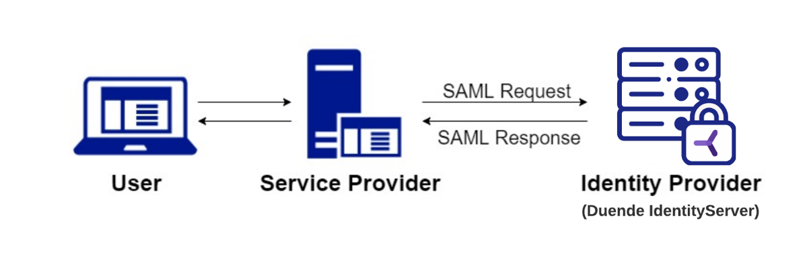

# SAML
The Security Assertion Markup Language (SAML) protocol is used to exchange authentication data between parties. There are two sides to the SAML protocol: Identity Provider (IdP) and Service Provider (SP).

## SAML Identity Provider

As a SAML Identity Provider, you can support cross-protocol SSO by allowing some applications to authenticate with your IdentityServer using SAML and others using OpenID Connect. In this role, IdentityServer acts in its traditional role as an authorization server/identity provider. Both protocols share the same SSO session, providing the user with a single sign-on experience.

All the SAML interactions are abstracted away in the IdentityServer, allowing for seamless cross-protocol SSO

## SAML Service Provider

As a service provider, you can federate with external SAML identity providers. The external identity provider holds the user credentials, and you send them SAML authentication requests.

In this role, IdentityServer uses an external identity provider for logins, similar to how you would offer “login using Google” functionality

`uuid_extract_timestamp(uuid)`: Since v7 IDs contain the time they were created, you can pull that data back out. This effectively lets the ID double as a created_at field.

`uuid_extract_version(uuid)`: Useful for verifying if an ID is actually a v7.